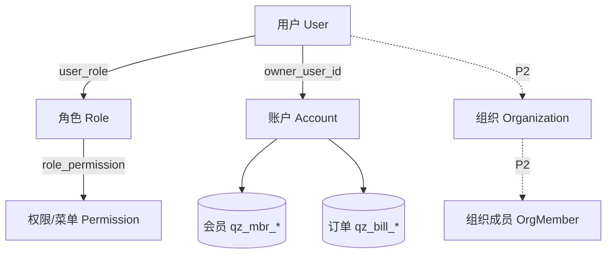
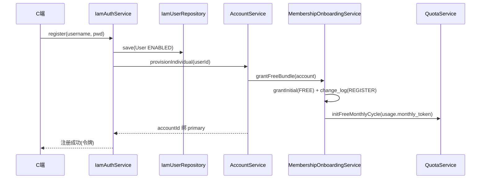
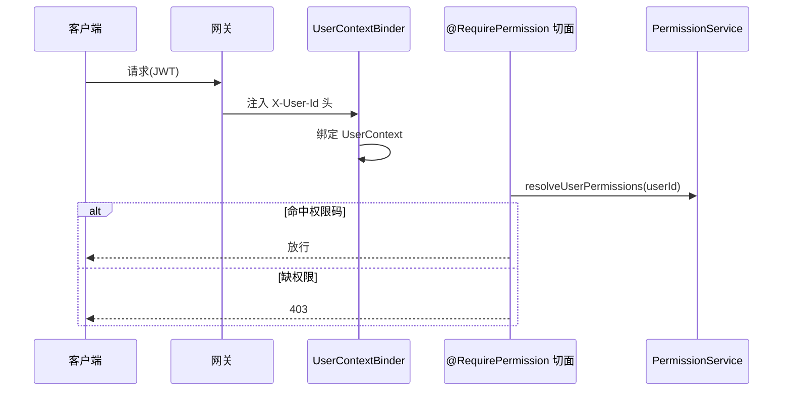

# 模块详细设计 · 账号管理（Account & IAM）

> 版本：v1（字段级 + 接口级）
> 归属模块：`cognitive-enhancement-ai-platform`（admin/app 双端复用 service）
> 关联：`docs/platform-architecture.md`、`docs/module-design-membership.md`、`docs/module-design-billing.md`
> 产品基线：`CognitiveEnhancementJAiView/docs/后台管理设计.md`（ToC 单租户）

---

## 0. 设计要点（锁定决策）

| # | 决策 | 结论 |
|---|---|---|
| A1 | 用户模型 | **统一用户表** `qz_iam_user`：C 端用户 + 后台运营人员同表，新增 `user_type` 字段区分（`ADMIN`/`CUSTOMER`），再按角色细分权限 |
| A2 | 账户容器 | `qz_acct_account`：承载会员/额度/订单的主体；ToC 下 **1 用户 : 1 个人账户** |
| A3 | 权限模型 | RBAC：用户—角色—权限（菜单 menu + 操作 action 同表 `qz_iam_permission`） |
| A4 | 多租户 | ToC 单租户（`tenant_id` 字段保留，默认 1）；2B/2G 组织开户 **P2 预留** |
| A5 | 鉴权 | OAuth2 + JWT；网关注入用户头，`UserContext` 绑定；`@RequirePermission` 校验 |
| A6 | 权限码 | 规范码 `iam:role:update` + 前端 alias `admin:role:update` 双码 |
| A7 | 封禁 | `status=BANNED` + `ban_reason/ban_until`，登录与令牌校验拦截；`ban_until` 到期**自动恢复** ENABLED |
| A8 | 注册方式 | **用户名密码 / 手机号验证码 / 邮箱**三种均支持，由系统安全配置（`qz_qz_sys_security_config`）**开关控制**启停 |
| A9 | 组织开户 | 2B/2G 组织开户**本期 P2 暂缓**，仅保留表与字段，不在 ToC 主线交付 |

---

## 1. 子域与对象总览



| 子域 | 表（库前缀） | 聚合根 | 状态 |
|---|---|---|---|
| 用户 | `qz_iam_user` | User | 启用 |
| 角色 | `qz_iam_role` | Role | 启用 |
| 权限/菜单 | `qz_iam_permission` | Permission | 启用 |
| 用户角色 | `qz_iam_user_role` | （关系） | 启用 |
| 角色权限 | `qz_iam_role_permission` | （关系） | 启用 |
| 租户 | `qz_iam_tenant` | Tenant | 单租户 |
| 账户 | `qz_acct_account` | Account | 启用 |
| 组织 / 部门 / 成员 | `qz_acct_org*` | Organization | **P2** |

---

## 2. 数据模型（DO 字段级）

### 2.1 `qz_iam_user` 用户

| 字段 | 类型 | 说明 |
|---|---|---|
| id / tenant_id | | |
| username | VARCHAR(64) U | 登录名 |
| user_type | VARCHAR(16) | **ADMIN（后台人员）/ CUSTOMER（前台用户）**，默认 CUSTOMER |
| password_hash | VARCHAR(128) | BCrypt |
| nickname / email / phone / avatar_url | | 资料 |
| status | VARCHAR(16) | ENABLED/DISABLED/BANNED |
| ban_reason / ban_until | | 封禁原因/截止 |
| last_login_time | DATETIME | |
| primary_account_id | BIGINT | 默认账户 |
| + 审计列（create_by/update_by/time/deleted/version） | | |

### 2.2 `qz_iam_role` 角色

| 字段 | 类型 | 说明 |
|---|---|---|
| id / tenant_id | | |
| role_code | VARCHAR(64) U | |
| role_name / description | | |
| status | VARCHAR(16) | ENABLED/DISABLED |
| builtin | TINYINT | 内置角色不可删 |
| avatar_color | VARCHAR(32) | 前端展示 |
| + 审计列 | | |

### 2.3 `qz_iam_permission` 权限/菜单（菜单 + 操作同表）

| 字段 | 类型 | 说明 |
|---|---|---|
| id / tenant_id | | |
| permission_code | VARCHAR(128) U | 规范码 `iam:role:update` |
| alias_code | VARCHAR(128) | 前端码 `admin:role:update` |
| permission_name | VARCHAR(128) | |
| kind | VARCHAR(16) | menu / action |
| scope | VARCHAR(16) | admin / cog（控制台） |
| module_key / group_key / parent_menu_key | | 菜单归类 |
| parent_id | BIGINT | 菜单树 |
| path / component / icon / sort_no | | 前端路由 |
| builtin / status | | |
| + 审计列 | | |

### 2.4 关系表
- `qz_iam_user_role(user_id, role_id)` PK 复合
- `qz_iam_role_permission(role_id, permission_id)` U

### 2.5 `qz_acct_account` 账户

| 字段 | 类型 | 说明 |
|---|---|---|
| id / tenant_id | | |
| account_type | VARCHAR(16) | INDIVIDUAL/ENTERPRISE/GOVERNMENT |
| segment | VARCHAR(8) | 2C/2B/2G |
| display_name | VARCHAR(128) | |
| owner_user_id | BIGINT | 归属用户 |
| status | VARCHAR(16) | ENABLED/DISABLED |
| + 审计列 | | |

### 2.6 `qz_acct_org*`（P2 预留）
`qz_acct_org`（组织）/ `qz_acct_org_department`（部门）/ `qz_acct_org_member`（成员，OWNER/ADMIN/MEMBER）。本期不在 ToC 主线交付，字段沿用现状。

### 2.7 `qz_iam_tenant` 租户
单租户，`tenant_code/tenant_name/segment/status`。ToC 默认 `id=1`。

---

## 3. 状态机

### 用户
```
ENABLED ──停用──▶ DISABLED ──启用──▶ ENABLED
   │
   └──封禁(ban_until)──▶ BANNED ──ban_until到期(自动)/手动解封──▶ ENABLED
```
（BANNED：登录拒绝、令牌校验拒绝；**`ban_until` 到期自动恢复 ENABLED**——登录/鉴权校验时若 `now > ban_until` 则即时置回 ENABLED 并清空 `ban_reason/ban_until`；运营亦可手动提前解封）

---

## 4. 领域对象（BO，platform.iam.domain / platform.account.domain）

```
User(id, username, userType, nickname, email, phone, avatarUrl, status, banReason, banUntil,
     lastLoginTime, primaryAccountId, roleCodes)
Role(id, roleCode, roleName, description, status, builtin, avatarColor, permissionIds)
Permission(id, permissionCode, aliasCode, permissionName, kind, scope, moduleKey,
           parentId, path, component, icon, sortNo, builtin, status)
Account(id, accountType, segment, displayName, ownerUserId, status)
```

枚举：`UserType{ADMIN,CUSTOMER}`、`UserStatus{ENABLED,DISABLED,BANNED}`、`PermissionKind{menu,action}`、`PermissionScope{admin,cog}`、`RegisterMethod{USERNAME,PHONE,EMAIL}`、`AccountType{INDIVIDUAL,ENTERPRISE,GOVERNMENT}`、`Segment{2C,2B,2G}`、`OrgRole{OWNER,ADMIN,MEMBER}`。

---

## 5. 数据操作层（Repository 接口）

```java
interface UserRepository {
  PageResult<User> page(UserPageQuery q);
  Optional<User> findById(Long id);
  Optional<User> findByUsername(String username);
  List<String> findRoleCodes(Long userId);
  User save(User u);
  void replaceRoles(Long userId, List<Long> roleIds);
}
interface RoleRepository {
  PageResult<Role> page(RolePageQuery q);
  List<Role> listEnabled();
  Optional<Role> findById(Long id);
  Role save(Role r);
  void replacePermissions(Long roleId, List<Long> permissionIds);
  List<Long> findPermissionIds(Long roleId);
}
interface PermissionRepository {
  List<Permission> listAll();
  List<Permission> findByUser(Long userId);      // 鉴权聚合
  Optional<Permission> findById(Long id);
  Permission save(Permission p);
}
interface AccountRepository {
  Optional<Account> findById(Long id);
  Optional<Account> findIndividualByOwner(Long userId);
  PageResult<Account> page(AccountPageQuery q);
  Account save(Account a);
}
```

---

## 6. 业务操作层（Service 方法 + 规则）

### 6.1 UserAdminService（后台用户管理）
- `page/detail`（按 `user_type` 过滤，后台默认只看 ADMIN）；`create/update`（username 唯一校验，创建时 `user_type=ADMIN`）；`resetPassword`；`assignRoles`。
- `changeStatus`：启用/停用/封禁（写 `ban_reason/ban_until`），封禁后吊销在线令牌（P2）。

### 6.2 RoleService
- `page/list/detail/save/delete`（builtin 不可删）；`assignPermissions(roleId, ids)`。
- 删除角色前校验是否仍被用户引用。

### 6.3 PermissionService
- `listMenuTree`（kind=menu 树）、`listActions`；`save`（builtin 受限编辑）。
- `resolveUserPermissions(userId)`：聚合用户全部角色的权限码（含 alias），供 `AuthMe` 与 `@RequirePermission`。

### 6.4 AccountService（账户编排，事务）— **重构落点**
> 现状直注 8 个 Mapper（IAM/会员/额度/组织），违反分层。重构为依赖各域 **Repository / 域 Service**：
- `provisionIndividual(userId, displayName)`：建个人账户 → 调 `MembershipService.initDefault` + `QuotaService.initFree` + 绑 `primary_account_id`（跨域走 Service，不直插表）。
- `createOrganization(...)`：**P2**，开租户+组织+账户+默认会员额度。
- `getById / page`。

### 6.5 AuthService（认证：注册/登录，多方式可配）
- 注册方式由安全配置开关控制：`auth.register.username/phone/email`（来源 `SecurityConfigService`）。
  - `USERNAME`：用户名 + 密码；`PHONE`：手机号 + 验证码；`EMAIL`：邮箱 + 验证码/密码。
  - 关闭的方式直接拒绝（提示该注册方式未开放）。
  - C 端注册固定 `user_type=CUSTOMER`，并触发 `AccountService.provisionIndividual`。
- 登录同样支持对应启用方式；登录/鉴权前先做**封禁自动恢复检查**（见 6.7）。

### 6.6 AuthMeService（登录态聚合）
- `me(userId)`：用户基本信息 + 账户 + 会员态 + 额度概览 + 菜单树 + 权限码集合 → `AuthMeResult`。
- 数据来源：UserRepository + AccountRepository + MembershipService + QuotaService + PermissionService。

### 6.7 鉴权链路 + 封禁自动恢复
- 网关校验 JWT → 注入 `X-User-Id` 等头（`SecurityConstants`）。
- `UserContextBinder`（拦截器）解析头 → `UserContext`（threadlocal）。
- `@RequirePermission("iam:role:update")` 切面 → 命中用户权限码集合放行。
- **封禁自动恢复**：登录与令牌校验入口校验 `status`；若 `BANNED` 且 `ban_until != null && now > ban_until`，即时将用户置回 `ENABLED` 并清空 `ban_reason/ban_until` 后放行（无需独立定时任务，按访问触发；可选加兜底定时巡检）。

---

## 7. 接口设计（REST）

### 7.1 Admin（`/api/admin`）

| 方法 | 路径 | 说明 | 权限点 |
|---|---|---|---|
| GET | `/users` | 用户分页 | `iam:user:read` |
| POST | `/users` | 新增/更新用户 | `iam:user:update` |
| POST | `/users/{id}/status` | 启停/封禁 | `iam:user:update` |
| POST | `/users/{id}/reset-password` | 重置密码 | `iam:user:update` |
| POST | `/users/{id}/roles` | 分配角色 | `iam:user:assign` |
| GET | `/roles` | 角色分页 | `iam:role:read` |
| POST | `/roles` | 新增/更新角色 | `iam:role:update` |
| DELETE | `/roles/{id}` | 删除角色 | `iam:role:delete` |
| POST | `/roles/{id}/permissions` | 配置权限 | `iam:role:assign` |
| GET | `/permissions/tree` | 菜单+操作树 | `iam:permission:read` |
| GET | `/accounts` | 账户分页 | `iam:account:read` |
| GET | `/accounts/{id}` | 账户详情 | `iam:account:read` |

### 7.2 鉴权/账户公共

| 方法 | 路径 | 说明 |
|---|---|---|
| POST | `/api/auth/login` | 登录（`@SecurityRequirements()` 公开） |
| POST | `/api/auth/register` | 注册（C 端，公开） |
| GET | `/api/auth/me` | 当前用户聚合信息 |
| POST | `/api/auth/logout` | 注销 |

### 7.3 C 端（`/api/app/account`，App-Server）

| 方法 | 路径 | 说明 |
|---|---|---|
| GET | `/profile` | 我的资料 |
| PUT | `/profile` | 更新资料/头像 |
| POST | `/change-password` | 修改密码 |

### 7.4 关键出参（VO 草案）

```jsonc
// GET /api/auth/me → AuthMeResult
{
  "user": { "id": 1, "username": "alice", "nickname": "Alice" },
  "account": { "id": 9, "displayName": "Alice", "segment": "2C" },
  "membership": { "levelCode": "PRO", "expireAt": "2026-12-31T00:00:00" },
  "quota": { "cycleRemaining": 80000, "giftRemaining": 0, "topupRemaining": 5000 },
  "menus": [ /* 菜单树 */ ],
  "permissions": ["admin:user:read", "admin:role:update"]
}
```

---

## 8. 关键流程

### 8.1 C 端注册开户


注册后用户通过 `/api/app/auth/me` 可见 `membership.levelCode=FREE` 与 `quota.cycleRemaining`（仅月度 cycle 桶，无 gift 新人礼）。额度值来自权益目录 `usage.monthly_token`，幂等键 `onboarding:free:{accountId}`。

### 8.2 鉴权 + 权限校验


---

## 9. 权限点（规范）

| 规范码 | 前端 alias | 说明 |
|---|---|---|
| `iam:user:read` | `admin:user:read` | 查看用户 |
| `iam:user:update` | `admin:user:update` | 编辑/启停/封禁/重置密码 |
| `iam:user:assign` | `admin:user:assign` | 分配角色 |
| `iam:role:read` | `admin:role:read` | 查看角色 |
| `iam:role:update` | `admin:role:update` | 编辑角色 |
| `iam:role:delete` | `admin:role:delete` | 删除角色 |
| `iam:role:assign` | `admin:role:assign` | 配置角色权限 |
| `iam:permission:read` | `admin:permission:read` | 查看菜单/权限 |
| `iam:account:read` | `admin:account:read` | 查看账户 |

---

## 10. 与现状差异（落地提示）

| 项 | 现状 | 目标 |
|---|---|---|
| 归属 | `platform` + admin/app 复用 | ✅ |
| `AccountService` | 各域 Repository 编排 | ✅ |
| 内置角色权限 | V29 OPERATOR/CONTENT/SUPPORT 种子 + 多角色工作台 IT | ✅ |
| Controller | 返回 VO | 🔄 持续演进 |
| 注册三方式 | USERNAME/PHONE/EMAIL + 配置开关 | ✅ |
| 封禁吊销令牌 | `UserSessionRevoker` 清理 OAuth2 授权 | ✅ |
| 组织 2B/2G | `createOrganization` + Admin IT | ✅ |

---

## 11. 已确认决策（2026-06-22）

1. ✅ **同表**：C 端用户与后台运营人员共用 `qz_iam_user`，新增 `user_type` 字段区分（ADMIN/CUSTOMER），再按角色细分权限。
2. ✅ **注册方式三选均支持**：用户名密码 / 手机号验证码 / 邮箱，由 `qz_qz_sys_security_config` 开关分别启停。
3. ✅ **封禁自动恢复**：`ban_until` 到期按访问触发即时恢复 ENABLED（可选兜底定时巡检），运营亦可手动提前解封。
4. ✅ **组织开户 P2 暂缓**：2B/2G 仅保留表与字段，不在 ToC 主线交付。

---

_下一模块建议：**知识内容**（内容/标签/知识包/导入任务）或 **数据运营**（Banner/公告/消息模板）。_
