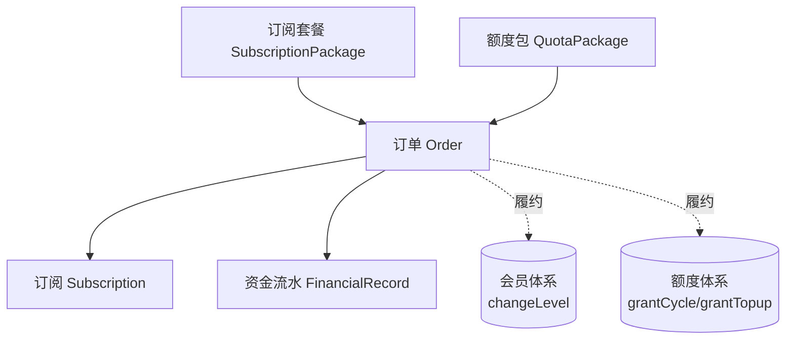
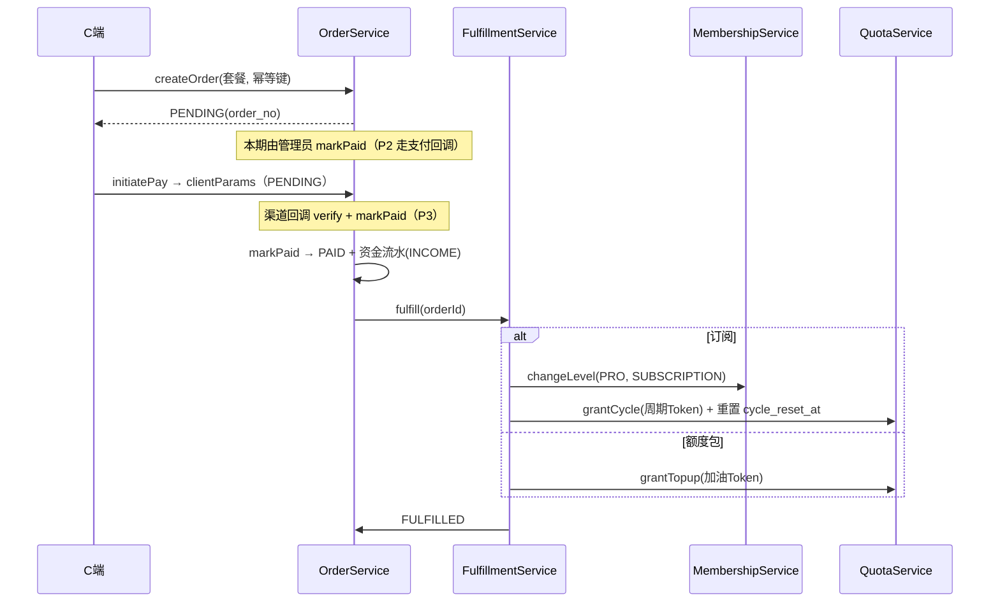
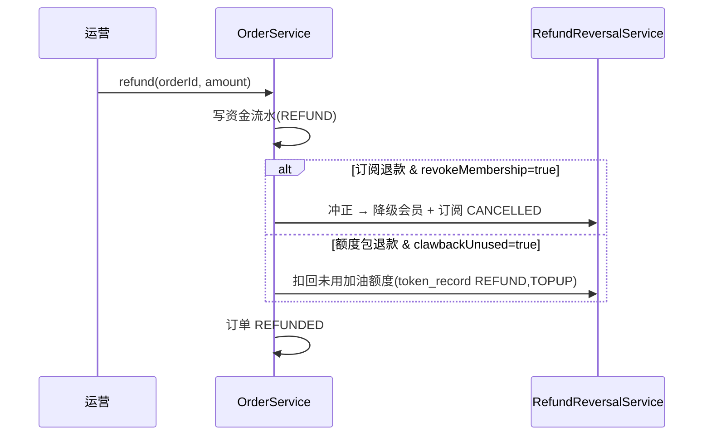

# 模块详细设计 · 套餐计费（Billing）

> 版本：v1（字段级 + 接口级）
> 归属模块：`cognitive-enhancement-ai-platform`（共享业务域，admin/app 双端复用 service）
> 关联：`docs/platform-architecture.md`、`docs/module-design-membership.md`（履约落点）
> 产品基线：`CognitiveEnhancementJAiView/docs/后台管理设计.md` §③

---

## 0. 设计要点（锁定决策）

| # | 决策 | 结论 |
|---|---|---|
| B1 | 套餐模型 | **双套餐**：订阅会员套餐 / 一次性额度包（加油包） |
| B2 | 会员-套餐关系 | 解耦：订阅套餐赋予会员等级；额度包不改身份 |
| B3 | 价格单位 | 整数分 `*_fen`，下单落**套餐快照** |
| B4 | 订单幂等 | `idempotency_key` 唯一约束 |
| B5 | 支付方式 | 本期**手动标记已支付**；真实支付 P2（预留验签回调） |
| B6 | 履约 | 订阅→改等级+发周期额度；额度包→发加油额度 |
| B7 | 双账分离 | 资金流水(`qz_bill_financial_record`) / Token 流水(`qz_mbr_token_record`) |
| B8 | 自动续费 | 本期不做（`auto_renew` 预埋） |
| B9 | 加油额度 | 永久不过期（额度包无有效期字段） |
| B10 | 退款策略默认值 | 订阅退款**默认回收会员**（降级）；额度包退款**默认扣回未用额度**（均可配） |
| B11 | 额度退款口径 | 按**剩余加油额度**扣回：`min(退款对应额度, topup_remaining)` |
| B12 | 待支付超时 | 订单 PENDING 超 **30 分钟**自动关闭（CLOSED） |
| B13 | 试用期 | **本期启用** `trial_days`：订阅履约时按试用天数发放试用期，到期转正式周期 |

---

## 1. 子域与对象总览



| 子域 | 表（`qz_bill_*`） | 聚合根 |
|---|---|---|
| 订阅会员套餐 | `qz_bill_subscription_package` | SubscriptionPackage |
| 一次性额度包 | `qz_bill_quota_package` | QuotaPackage |
| 订单 | `qz_bill_order` | Order |
| 订阅 | `qz_bill_subscription` | Subscription |
| 资金流水 | `qz_bill_financial_record` | （流水） |

> Token 流水归会员体系（`qz_mbr_token_record`），计费侧履约时调用 `QuotaService` 写入。

---

## 2. 数据模型（DO 字段级）

### 2.1 `qz_bill_subscription_package` 订阅会员套餐

| 字段 | 类型 | 说明 |
|---|---|---|
| id / tenant_id | | |
| package_code | VARCHAR(64) U | |
| package_name | VARCHAR(128) | |
| level_id / level_code | | 关联会员等级 |
| billing_period | VARCHAR(16) | MONTH/QUARTER/YEAR |
| period_count | INT | 周期数（如 12 个月） |
| price_fen / original_price_fen | BIGINT | 现价/原价 |
| cycle_token_quota | BIGINT | 每周期发放 Token |
| daily_limit | BIGINT | 每日 Token 上限（0=不限） |
| concurrent_limit | INT | 并发上限 |
| model_scope_json | JSON | 可用模型范围 |
| trial_days | INT | 试用期天数（0=无） |
| sort_no / status | | status: ON_SALE/OFF_SALE |
| + 审计列 | | |

### 2.2 `qz_bill_quota_package` 一次性额度包（加油包）

| 字段 | 类型 | 说明 |
|---|---|---|
| id / tenant_id | | |
| package_code | VARCHAR(64) U | |
| package_name | VARCHAR(128) | |
| token_amount | BIGINT | 发放加油 Token 数 |
| price_fen / original_price_fen | BIGINT | |
| model_scope_json | JSON | 可用模型范围 |
| purchase_limit | INT | 限购次数（0=不限） |
| sort_no / status | | （**无有效期字段**——加油额度永久） |
| + 审计列 | | |

### 2.3 `qz_bill_order` 订单

| 字段 | 类型 | 说明 |
|---|---|---|
| id / tenant_id | | |
| order_no | VARCHAR(64) U | 业务单号 |
| account_id / buyer_user_id | | |
| order_type | VARCHAR(16) | SUBSCRIPTION/QUOTA |
| package_id | BIGINT | |
| package_snapshot_json | JSON | 下单价格/权益快照 |
| amount_fen | BIGINT | 应付金额 |
| currency | VARCHAR(8) | CNY |
| status | VARCHAR(16) | PENDING/PAID/FULFILLED/REFUNDED/CLOSED |
| pay_channel | VARCHAR(32) | MANUAL/（P2 真实渠道） |
| pay_time / fulfill_time / refund_time | DATETIME | |
| idempotency_key | VARCHAR(64) U | 防重复下单 |
| refund_amount_fen | BIGINT | 退款额 |
| remark | VARCHAR(512) | |
| + 审计列 | | |

### 2.4 `qz_bill_subscription` 订阅

| 字段 | 类型 | 说明 |
|---|---|---|
| id / tenant_id / account_id | | |
| order_id / package_id | | |
| level_code | VARCHAR(32) | |
| status | VARCHAR(16) | ACTIVE/EXPIRED/CANCELLED |
| phase | VARCHAR(16) | TRIAL/FORMAL（试用段/正式段） |
| start_at / end_at | DATETIME | 当前段起止（试用段 end=试用到期） |
| auto_renew | TINYINT | 预埋，本期 0 |
| package_snapshot_json | JSON | |
| + 审计列 | | |

> 约定：同一账户**仅 1 个 ACTIVE 订阅**（续期叠加 end_at，升级替换）。

### 2.5 `qz_bill_financial_record` 资金流水

| 字段 | 类型 | 说明 |
|---|---|---|
| id / tenant_id / account_id | | |
| order_id | BIGINT | |
| record_type | VARCHAR(32) | INCOME/REFUND |
| amount_fen | BIGINT | 正负 |
| remark / create_time | | 只写不改 |

---

## 3. 状态机

### 3.1 订单
```
PENDING ──markPaid──▶ PAID ──fulfill──▶ FULFILLED ──refund──▶ REFUNDED
   │                                         
   └──cancel/timeout──▶ CLOSED              （PAID 也可 refund→REFUNDED）
```

### 3.2 订阅
```
ACTIVE ──到期(定时)──▶ EXPIRED
  │
  └──取消/退款回收──▶ CANCELLED
```

---

## 4. 领域对象（BO，platform.billing.domain）

```
SubscriptionPackage(id, packageCode, packageName, levelCode, billingPeriod, periodCount,
                    priceFen, originalPriceFen, cycleTokenQuota, dailyLimit, concurrentLimit,
                    modelScope, trialDays, sortNo, status)
QuotaPackage(id, packageCode, packageName, tokenAmount, priceFen, originalPriceFen,
             modelScope, purchaseLimit, sortNo, status)
Order(id, orderNo, accountId, buyerUserId, orderType, packageId, packageSnapshot,
      amountFen, currency, status, payChannel, payTime, fulfillTime, idempotencyKey,
      refundAmountFen, refundTime, remark)
Subscription(id, accountId, orderId, packageId, levelCode, status, startAt, endAt, autoRenew)
FinancialRecord(accountId, orderId, recordType, amountFen, remark)
```

枚举：`OrderType{SUBSCRIPTION,QUOTA}`、`OrderStatus`、`SubscriptionStatus`、`BillingPeriod{MONTH,QUARTER,YEAR}`、`FinancialRecordType{INCOME,REFUND}`、`PackageStatus{ON_SALE,OFF_SALE}`。

---

## 5. 数据操作层（Repository 接口）

```java
interface SubscriptionPackageRepository {
  PageResult<SubscriptionPackage> page(PackagePageQuery q);
  List<SubscriptionPackage> listOnSale();
  Optional<SubscriptionPackage> findById(Long id);
  SubscriptionPackage save(SubscriptionPackage p);
}
interface QuotaPackageRepository { /* 同构 */ }
interface OrderRepository {
  PageResult<Order> page(OrderPageQuery q);
  Optional<Order> findById(Long id);
  Optional<Order> findByIdempotency(String key);
  Order save(Order o);
}
interface SubscriptionRepository {
  Optional<Subscription> findActiveByAccount(Long accountId);
  Subscription save(Subscription s);
  List<Subscription> findExpiring(LocalDateTime before); // 定时
}
interface FinancialRecordRepository {
  void append(FinancialRecord r);
  PageResult<FinancialRecord> page(FinancialPageQuery q);
}
```

---

## 6. 业务操作层（Service 方法 + 规则）

### 6.1 PackageService（套餐维护）
- 订阅套餐/额度包的 `page/listOnSale/get/save/changeStatus`。
- 上架校验：订阅套餐 `level_code` 必须存在且启用。

### 6.2 OrderService（下单/支付/退款编排，事务）
- `createOrder(CreateOrderCommand)`：
  1. `idempotency_key` 命中→返回既有订单；
  2. 取套餐→落 `package_snapshot_json` + `amount_fen`；
  3. 生成 `order_no`，状态 PENDING。
- `markPaid(id, MarkPaidCommand)`：PENDING→PAID，记 `pay_channel=MANUAL`、`pay_time`；写资金流水(INCOME)；触发 `FulfillmentService.fulfill`。
- `refund(id, RefundCommand)`：PAID/FULFILLED→REFUNDED；写资金流水(REFUND)；FULFILLED 时调 `RefundReversalService` 冲正。
- `cancel(id)`：PENDING→CLOSED。
- 查询：`page/detail`。

### 6.3 FulfillmentService（履约，跨域）
- `fulfill(orderId)` 按 `order_type`：
  - **SUBSCRIPTION**：`MembershipService.changeLevel(level, source=SUBSCRIPTION, orderId)` + 建/续 `Subscription` + `QuotaService.grantCycle(cycle_token_quota)` + 重置 `cycle_reset_at`。
    - **试用期（trial_days>0）**：`end_at = now + trial_days`，订阅标记试用段；试用到期由 `BillingLifecycleService` 推进为正式周期（`end_at += period`，按 `billing_period × period_count`），正式段再发周期额度。`trial_days=0` 时直接进正式周期。
  - **QUOTA**：`QuotaService.grantTopup(token_amount, biz=order)`。
  - 订单 → FULFILLED，记 `fulfill_time`。
- 幂等：已 FULFILLED 不重复发放。

### 6.4 RefundReversalService（退款冲正，可配策略）
- 订阅退款：策略 `revokeMembershipOnRefund`（**默认 true**）→ `MembershipService.expireAndDowngrade` + 订阅置 CANCELLED。
- 额度包退款：策略 `clawbackUnusedTopup`（**默认 true**）→ 按**剩余加油额度**扣回 `min(退款对应额度, topup_remaining)`，写 token_record(REFUND,TOPUP)；剩余不足则按实际剩余扣回（不扣成负）。
- 策略来源：`qz_qz_sys_security_config`（`refund.revokeMembership` / `refund.clawbackUnused`）。

### 6.5 BillingLifecycleService（定时，admin-server 调度）
- 订阅到期：`end_at<now` 的 ACTIVE → EXPIRED（联动会员到期由会员定时处理或此处统一触发）。
- **试用转正**：试用段订阅 `end_at(试用)<now` → 推进为正式周期并发放周期额度。
- 待支付超时：`PENDING` 超 **30 分钟** → CLOSED（时长读 `qz_qz_sys_security_config: order.pendingTimeoutMinutes`，默认 30）。

### 6.6 PaymentCallbackService（P2 预留）
- `handleCallback(channel, payload)`：验签（`PaymentChannelSignatureVerifier`）→ 幂等 → 等价于 `markPaid`。本期占位，不接真实渠道。

---

## 7. 接口设计（REST）

### 7.1 Admin（`/api/admin/billing`）

| 方法 | 路径 | 说明 | 权限点 |
|---|---|---|---|
| GET | `/subscription-packages` | 订阅套餐分页 | `billing:package:read` |
| POST | `/subscription-packages` | 新增/更新订阅套餐 | `billing:package:update` |
| GET | `/quota-packages` | 额度包分页 | `billing:package:read` |
| POST | `/quota-packages` | 新增/更新额度包 | `billing:package:update` |
| GET | `/subscriptions` | 订阅分页 | `billing:order:read` |
| GET | `/financial-records` | 资金流水分页 | `billing:order:read` |
| GET | `/orders` | 订单分页（orderNo/status/account 过滤） | `billing:order:read` |
| GET | `/orders/{id}` | 订单详情 | `billing:order:read` |
| POST | `/orders/{id}/mark-paid` | 手动标记已支付 | `billing:order:update` |
| POST | `/orders/{id}/refund` | 手动退款 | `billing:order:refund` |

### 7.2 C 端（`/api/app/billing`，App-Server）

| 方法 | 路径 | 说明 |
|---|---|---|
| GET | `/subscription-packages` | 在售订阅套餐 |
| GET | `/quota-packages` | 在售额度包 |
| POST | `/orders` | 下单（带幂等键） |
| GET | `/orders` | 我的订单 |
| GET | `/orders/{id}` | 订单详情 |
| POST | `/orders/{id}/pay` | 发起预支付，返回 `clientParams`（MOCK/WECHAT/ALIPAY） |
| POST | `/pay-callback/{channel}` | 渠道支付结果回调（公开，验签后 markPaid） |

### 7.3 关键出参（VO 草案）

```jsonc
// POST /api/app/billing/orders/{id}/pay → 预支付
{
  "orderId": 1,
  "orderNo": "QZ20260624xxxx",
  "payChannel": "MOCK",
  "status": "PENDING",
  "amountFen": 9900,
  "clientParams": { "mockPayToken": "...", "callbackPath": "/api/app/billing/pay-callback/MOCK" }
}
```

---

## 8. 关键流程

### 8.1 下单 → 支付 → 履约


### 8.2 退款冲正


---

## 9. 权限点（规范）

| 规范码 | 前端 alias | 说明 |
|---|---|---|
| `billing:package:read` | `admin:package:read` | 查看套餐 |
| `billing:package:update` | `admin:package:update` | 编辑套餐/上下架 |
| `billing:order:read` | `admin:order:read` | 查看订单/订阅/流水 |
| `billing:order:update` | `admin:order:update` | 标记已支付 |
| `billing:order:refund` | `admin:order:refund` | 退款 |

---

## 10. 与现状差异（落地提示）

| 项 | 现状 | 目标 |
|---|---|---|
| 归属 | `platform`，admin/app 复用 | ✅ |
| 分层 | service→repository→mapper，Controller 返回 VO | 🔄 持续演进 |
| 表名 | `qz_bill_*` | ✅ |
| 套餐字段 | V31 `daily_limit` / `concurrent_limit` / `model_scope` | ✅ |
| 退款策略 | `qz_sys_security_config` 可配 | ✅ |
| 支付回调 | `PaymentChannelGateway` 预下单 + `PaymentCallbackService` canonical 验签 + app IT | ✅ |

---

## 11. 已确认决策（2026-06-22）

1. ✅ **退款默认策略认可**：订阅退款默认回收会员（降级）、额度包默认扣回未用额度（均可配，配置在 `qz_qz_sys_security_config`）。
2. ✅ **额度退款按"剩余加油额度"扣回**：`min(退款对应额度, topup_remaining)`，不精确追溯单笔消耗。
3. ✅ **待支付超时 30 分钟**自动关闭（CLOSED），时长可配 `order.pendingTimeoutMinutes`（默认 30）。
4. ✅ **试用期启用**：订阅履约支持 `trial_days`，新增 `phase(TRIAL/FORMAL)`，试用到期由定时任务转正式周期并发周期额度。

---

_下一模块建议：**账号管理**（用户/RBAC/账户）或 **知识内容**。_
