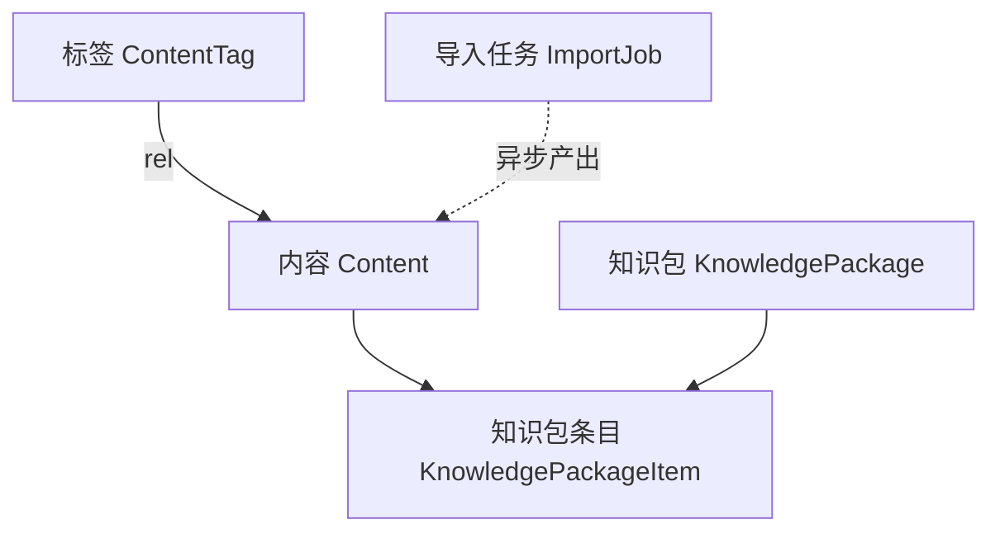
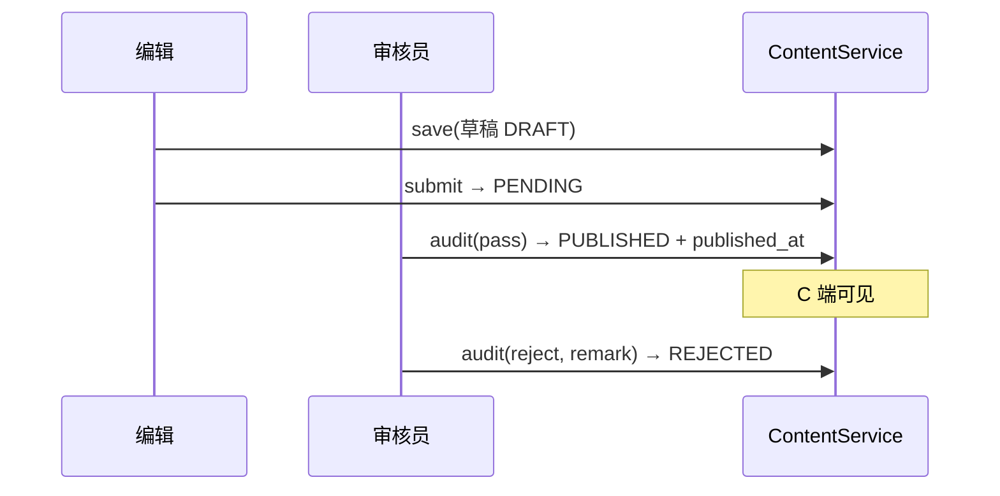
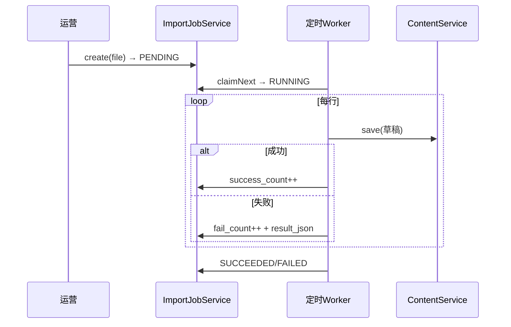

# 模块详细设计 · 知识内容（Knowledge / CMS）

> 版本：v1（字段级 + 接口级）
> 归属模块：`cognitive-enhancement-ai-platform`（admin 维护 + app 消费）
> 关联：`docs/platform-architecture.md`、`docs/module-design-account.md`
> 产品基线：`CognitiveEnhancementJAiView/docs/后台管理设计.md`（知识内容 / 学习链路）

---

## 0. 设计要点（锁定决策）

| # | 决策 | 结论 |
|---|---|---|
| K1 | 内容审核 | 内容有**审核态**：DRAFT→PENDING→PUBLISHED/REJECTED，C 端仅见 PUBLISHED |
| K2 | 标签 | 多对多，标签独立维护（`tag_name` 租户内唯一） |
| K3 | 知识包 | 知识包 = 内容的**树形编排**（章/节），条目可引用内容或纯目录节点 |
| K4 | 内容正文 | `body MEDIUMTEXT`（Markdown/富文本），大字段与列表查询分离 |
| K5 | 批量导入 | **异步任务**：上传 **CSV** 文件→后台解析→逐条入库，记成功/失败明细 |
| K6 | C 端消费 | 只读已发布内容 + 已启用知识包 |
| K7 | 会员等级可见性 | **启用**：内容设 `min_level_code`（可读最低等级），C 端按用户会员等级过滤 |
| K8 | 条目复用 | **允许**同一内容跨知识包/多节点挂载（`content_id` 可重复引用） |
| K9 | 版本历史 | **启用**：内容每次发布快照入 `qz_kb_content_version`，支持回溯/回滚 |

---

## 1. 子域与对象总览



| 子域 | 表（`qz_kb_*`） | 聚合根 |
|---|---|---|
| 内容 | `qz_kb_content` | Content |
| 内容版本 | `qz_kb_content_version` | ContentVersion |
| 标签 / 关联 | `qz_kb_content_tag` / `qz_kb_content_tag_rel` | ContentTag |
| 知识包 / 条目 | `qz_kb_knowledge_package` / `qz_kb_knowledge_package_item` | KnowledgePackage |
| 导入任务 | `qz_kb_content_import_job` | ContentImportJob |

---

## 2. 数据模型（DO 字段级）

### 2.1 `qz_kb_content` 内容

| 字段 | 类型 | 说明 |
|---|---|---|
| id / tenant_id | | |
| title | VARCHAR(256) | 标题 |
| content_type | VARCHAR(32) | ARTICLE/...（字典） |
| author | VARCHAR(128) | |
| status | VARCHAR(16) | DRAFT/PENDING/PUBLISHED/REJECTED |
| summary | VARCHAR(512) | 摘要（列表展示） |
| body | MEDIUMTEXT | 正文（详情才取） |
| min_level_code | VARCHAR(32) | 可读最低会员等级（null/`FREE`=全员可读） |
| current_version | INT | 当前版本号（每次发布 +1） |
| audit_remark | VARCHAR(512) | 审核意见 |
| published_at | DATETIME | 发布时间 |
| + 审计列 | | |

> 列表查询投影排除 `body`，避免大字段拖慢分页。

### 2.1.1 `qz_kb_content_version` 内容版本（发布快照，只追加）

| 字段 | 类型 | 说明 |
|---|---|---|
| id / tenant_id | | |
| content_id | BIGINT | 所属内容 |
| version_no | INT | 版本号（与 content_id 联合唯一） |
| title / summary / body | | 该版本快照 |
| min_level_code | VARCHAR(32) | 该版本可见性快照 |
| operator_id | BIGINT | 发布人 |
| create_time | | 无 update/deleted |

### 2.2 `qz_kb_content_tag` 标签 / `qz_kb_content_tag_rel` 关联

| 字段 | 类型 | 说明 |
|---|---|---|
| id / tenant_id | | |
| tag_name | VARCHAR(64) | 租户内唯一 |
| tag_color | VARCHAR(32) | 前端展示 |

关联：`qz_kb_content_tag_rel(content_id, tag_id)` PK 复合。

### 2.3 `qz_kb_knowledge_package` 知识包

| 字段 | 类型 | 说明 |
|---|---|---|
| id / tenant_id | | |
| package_name | VARCHAR(128) | |
| description | VARCHAR(512) | |
| status | VARCHAR(16) | ENABLED/DISABLED |
| + 审计列 | | |

### 2.4 `qz_kb_knowledge_package_item` 知识包条目（树）

| 字段 | 类型 | 说明 |
|---|---|---|
| id | | |
| package_id | BIGINT | 所属知识包 |
| parent_id | BIGINT | 0=根，支持章/节树 |
| content_id | BIGINT | 引用内容（null=纯目录节点） |
| title | VARCHAR(256) | 节点标题（目录节点用） |
| sort_no | INT | 排序 |

### 2.5 `qz_kb_content_import_job` 导入任务

| 字段 | 类型 | 说明 |
|---|---|---|
| id / tenant_id | | |
| file_name / file_url | | 源文件 |
| status | VARCHAR(16) | PENDING/RUNNING/SUCCEEDED/FAILED |
| total_count / success_count / fail_count | INT | 统计 |
| result_json | JSON | 失败行明细 |
| create_by / create_time / update_time | | |

---

## 3. 状态机

### 3.1 内容
```
DRAFT ──提交审核──▶ PENDING ──通过──▶ PUBLISHED ──下架──▶ DRAFT
                       │
                       └──驳回(audit_remark)──▶ REJECTED ──编辑──▶ DRAFT
```

### 3.2 导入任务
```
PENDING ──worker领取──▶ RUNNING ──完成──▶ SUCCEEDED / FAILED
```

---

## 4. 领域对象（BO，platform.knowledge.domain）

```
Content(id, title, contentType, author, status, summary, body, minLevelCode,
        currentVersion, auditRemark, publishedAt, tagIds)
ContentVersion(id, contentId, versionNo, title, summary, body, minLevelCode, operatorId)
ContentTag(id, tagName, tagColor)
KnowledgePackage(id, packageName, description, status, items)
KnowledgePackageItem(id, packageId, parentId, contentId, title, sortNo, children)
ContentImportJob(id, fileName, fileUrl, status, totalCount, successCount, failCount, result)
```

枚举：`ContentStatus{DRAFT,PENDING,PUBLISHED,REJECTED}`、`ImportJobStatus{PENDING,RUNNING,SUCCEEDED,FAILED}`、`PackageStatus{ENABLED,DISABLED}`。

---

## 5. 数据操作层（Repository 接口）

```java
interface ContentRepository {
  PageResult<Content> page(ContentPageQuery q);     // 投影排除 body
  Optional<Content> findById(Long id);              // 含 body
  List<Content> findPublishedByIds(List<Long> ids);
  Content save(Content c);
}
interface ContentVersionRepository {
  void append(ContentVersion v);                    // 发布时快照
  List<ContentVersion> listByContent(Long contentId);
  Optional<ContentVersion> find(Long contentId, int versionNo);
}
interface ContentTagRepository {
  PageResult<ContentTag> page(ContentTagPageQuery q);
  List<ContentTag> listAll();
  ContentTag save(ContentTag t);
  void bind(Long contentId, List<Long> tagIds);     // 重置关联
  List<Long> findTagIds(Long contentId);
}
interface KnowledgePackageRepository {
  PageResult<KnowledgePackage> page(KnowledgePackagePageQuery q);
  Optional<KnowledgePackage> findById(Long id);
  List<KnowledgePackageItem> findItems(Long packageId);
  KnowledgePackage save(KnowledgePackage p);
  void saveItem(KnowledgePackageItem item);
  void deleteItem(Long itemId);
}
interface ContentImportJobRepository {
  PageResult<ContentImportJob> page(ContentImportJobPageQuery q);
  Optional<ContentImportJob> findById(Long id);
  Optional<ContentImportJob> claimNext();           // 定时领取 PENDING
  ContentImportJob save(ContentImportJob j);
}
```

---

## 6. 业务操作层（Service 方法 + 规则）

### 6.1 ContentService
- `page/detail/save`（草稿保存，可设 `min_level_code`）；`bindTags`。
- 审核流：`submit`(DRAFT→PENDING)、`audit(pass/reject, remark)`（→PUBLISHED 写 `published_at` / →REJECTED）、`unpublish`。
- **版本快照**：每次 `audit(pass)` 发布时 `current_version+1` 并 `ContentVersionRepository.append` 记快照。
- **版本回溯/回滚**：`listVersions(contentId)`、`rollback(contentId, versionNo)`（将历史版本内容回填为新草稿，走正常审核发布）。
- **C 端读 + 等级过滤**：`listPublished/getPublished` 强制 `status=PUBLISHED`，并按当前用户会员等级过滤 `min_level_code`（用户等级 ≥ 内容要求才可见/可读；不足时列表隐藏或详情返回"需升级"提示）。

### 6.2 ContentTagService
- `page/list/save`（tag_name 唯一校验）；删除前校验是否仍被内容引用。

### 6.3 KnowledgePackageService
- `page/detail/save/changeStatus`。
- 条目编排：`saveItem/moveItem/deleteItem`，维护 `parent_id + sort_no` 树；`getTree(packageId)` 组装树。
- 校验：`content_id` 必须存在；目录节点 `content_id=null` 须有 `title`。
- **允许同一 `content_id` 跨知识包/多节点重复挂载**（不做唯一约束，删除条目不影响内容本体）。

### 6.4 ContentImportJobProcessor（异步，CSV）
- `create(file)`：落 PENDING 任务（仅接受 **CSV**）。
- **CSV 约定**：表头列固定（如 `title,content_type,author,summary,body,min_level_code,tags`），UTF-8，逗号分隔；首行表头校验，缺列/格式错按行记失败。
- 调度（admin-server 定时 + ShedLock）：`claimNext`→RUNNING→逐行解析→`ContentService.save`（DRAFT）→累计 success/fail + `result_json`→SUCCEEDED/FAILED。
- 幂等：按行业务键去重；失败行不阻断整体。

---

## 7. 接口设计（REST）

### 7.1 Admin（`/api/admin/content`）

| 方法 | 路径 | 说明 | 权限点 |
|---|---|---|---|
| GET | `/contents` | 内容分页（标题/状态/标签过滤） | `kb:content:read` |
| GET | `/contents/{id}` | 内容详情（含正文） | `kb:content:read` |
| POST | `/contents` | 新增/更新草稿 | `kb:content:update` |
| POST | `/contents/{id}/submit` | 提交审核 | `kb:content:update` |
| POST | `/contents/{id}/audit` | 审核通过/驳回 | `kb:content:audit` |
| POST | `/contents/{id}/unpublish` | 下架 | `kb:content:audit` |
| GET | `/contents/{id}/versions` | 版本历史列表 | `kb:content:read` |
| POST | `/contents/{id}/rollback` | 回滚到指定版本（生成新草稿） | `kb:content:update` |
| POST | `/contents/{id}/tags` | 绑定标签 | `kb:content:update` |
| GET | `/tags` | 标签分页 | `kb:tag:read` |
| POST | `/tags` | 新增/更新标签 | `kb:tag:update` |
| GET | `/knowledge-packages` | 知识包分页 | `kb:package:read` |
| GET | `/knowledge-packages/{id}/tree` | 知识包条目树 | `kb:package:read` |
| POST | `/knowledge-packages` | 新增/更新知识包 | `kb:package:update` |
| POST | `/knowledge-packages/{id}/items` | 新增/移动条目 | `kb:package:update` |
| DELETE | `/knowledge-packages/items/{itemId}` | 删除条目 | `kb:package:update` |
| GET | `/import-jobs` | 导入任务分页 | `kb:content:read` |
| POST | `/import-jobs` | 创建导入任务 | `kb:content:import` |

### 7.2 C 端（`/api/app/knowledge`，App-Server）

| 方法 | 路径 | 说明 |
|---|---|---|
| GET | `/contents` | 已发布内容分页（标签筛选 + 按会员等级过滤可见） |
| GET | `/contents/{id}` | 已发布内容详情（等级不足返回"需升级"） |
| GET | `/packages` | 已启用知识包列表 |
| GET | `/packages/{id}/tree` | 知识包目录树（仅含已发布且当前等级可见内容） |

### 7.3 关键出参（VO 草案）

```jsonc
// GET /api/app/knowledge/packages/{id}/tree
{
  "id": 3, "packageName": "认知入门",
  "items": [
    { "id": 10, "title": "第一章", "contentId": null,
      "children": [ { "id": 11, "title": "什么是认知", "contentId": 100 } ] }
  ]
}
```

---

## 8. 关键流程

### 8.1 内容审核发布


### 8.2 批量导入


---

## 9. 权限点（规范）

| 规范码 | 前端 alias | 说明 |
|---|---|---|
| `kb:content:read` | `admin:content:read` | 查看内容/导入任务 |
| `kb:content:update` | `admin:content:update` | 编辑/草稿/提交/绑标签 |
| `kb:content:audit` | `admin:content:audit` | 审核/下架 |
| `kb:content:import` | `admin:content:import` | 批量导入 |
| `kb:tag:read` | `admin:tag:read` | 查看标签 |
| `kb:tag:update` | `admin:tag:update` | 维护标签 |
| `kb:package:read` | `admin:package:read` | 查看知识包 |
| `kb:package:update` | `admin:package:update` | 维护知识包/条目 |

---

## 10. 与现状差异（落地提示）

| 项 | 现状 | 目标 |
|---|---|---|
| 归属 | `platform` + admin/app | ✅ |
| 分层 | service→repository→mapper，Controller 返回 VO | ✅ 主路径 |
| C 端只读 | `/api/app/knowledge/*` | ✅ |
| 版本历史 | `qz_kb_content_version` + 审核发布快照 + `/versions` `/rollback` | ✅ |
| 列表查询 body | 分页投影排除 `body` 大字段 | ✅ |

---

## 11. 已确认决策（2026-06-22）

1. ✅ **会员等级可见性启用**：内容设 `min_level_code`，C 端按用户会员等级过滤可见/可读（不足提示升级）。
2. ✅ **导入格式 CSV**：固定表头列、UTF-8、逗号分隔；逐行校验，失败行记明细不阻断。
3. ✅ **允许条目复用**：同一内容可跨知识包/多节点重复挂载，删条目不影响内容本体。
4. ✅ **版本历史启用**：发布快照入 `qz_kb_content_version`，支持版本列表与回滚（回填为新草稿走审核）。

---

_下一模块建议：**数据运营**（Banner/公告/消息模板）或 **系统设置**（字典/特性开关/安全配置/审计日志）。_
