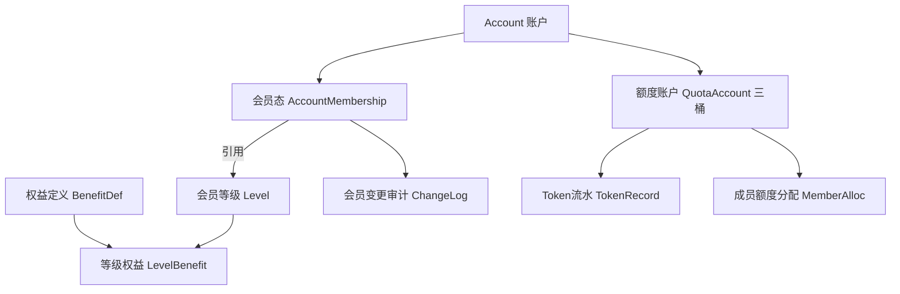
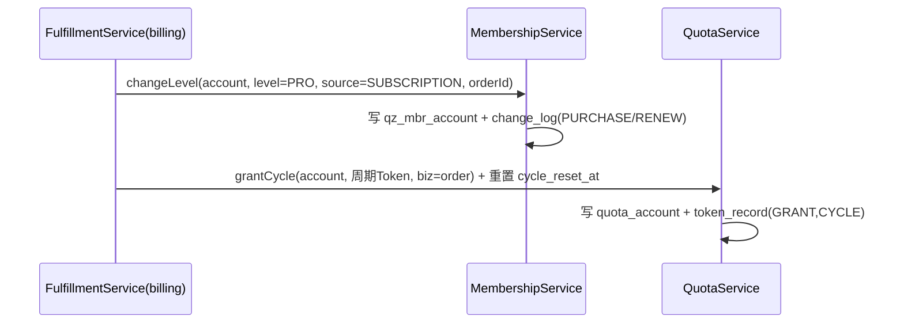
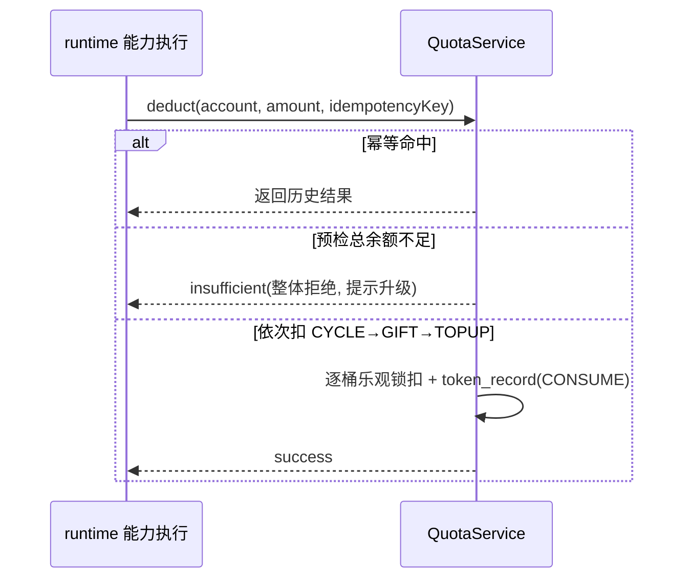

# 模块详细设计 · 会员体系（Membership）

> 版本：v1（字段级 + 接口级，决策已确认）
> 归属模块：`cognitive-enhancement-ai-platform`（共享业务域，admin/app 双端复用 service）
> 关联：`docs/platform-architecture.md`（架构与 `qz_` 前缀）、`docs/admin-backend-business-design.md`（业务蓝图）
> 产品基线：`CognitiveEnhancementJAiView/docs/后台管理设计.md` §②③

---

## 0. 已确认决策（Decision Log）

| # | 决策 | 结论 |
|---|---|---|
| M1 | 会员模型 | **会员 = 身份 + 可配置权益**，等级不硬编码权益 |
| M2 | 权益模型 | **规范化目录**：`benefit_def`（定义） + `level_benefit`（等级值）；`benefits_json` 仅作读优化快照 |
| M3 | 权益分类 | 功能 / 内容 / 用量 / 服务 四类 |
| M4 | 额度钱包 | 三层：周期 / 赠送 / 加油 |
| M5 | 扣减优先级 | 周期 → 赠送 → 加油 |
| M6 | 额度不足 | **整体拒绝**，不部分扣减；返回 insufficient 提示升级 |
| M7 | 加油额度 | **永久不过期**，可叠加 |
| M8 | 周期重置 | **随订阅周期**（按订阅生效日推进，非固定自然月） |
| M9 | 过期处理 | 降级 free，周期清零，赠送/加油保留 |
| M10 | 初始权益目录 | **本期建初始 `benefit_def` 目录**（见 §11） |

---

## 1. 子域与对象总览



| 子域 | 表（`qz_mbr_*`） | 聚合根 |
|---|---|---|
| 会员等级 | `qz_mbr_level` | Level |
| 权益定义目录 | `qz_mbr_benefit_def` ★新增 | BenefitDef |
| 等级权益值 | `qz_mbr_level_benefit` ★新增 | （LevelBenefit） |
| 账户会员态 | `qz_mbr_account` | Account |
| 会员变更审计 | `qz_mbr_change_log` | （日志） |
| 额度账户 | `qz_mbr_quota_account` | Account |
| Token 流水 | `qz_mbr_token_record` | （流水） |
| 成员额度分配 | `qz_mbr_member_alloc` | Account |

---

## 2. 数据模型（DO 字段级）

### 2.1 `qz_mbr_level` 会员等级

| 字段 | 类型 | 说明 |
|---|---|---|
| id | BIGINT PK | |
| tenant_id | BIGINT | 预埋，默认 1 |
| level_code | VARCHAR(32) U | `FREE/PRO/VIP…` |
| level_name | VARCHAR(64) | |
| is_default | TINYINT | 注册默认等级（全局仅 1 个） |
| sort_no | INT | 排序 |
| status | VARCHAR(16) | ENABLED/DISABLED |
| benefits_json | JSON | **权益快照缓存**（由 level_benefit 聚合生成，读优化） |
| + 审计列 | | create_by/update_by/create_time/update_time/deleted/version |

### 2.2 `qz_mbr_benefit_def` 权益定义目录 ★新增

| 字段 | 类型 | 说明 |
|---|---|---|
| id | BIGINT PK | |
| benefit_code | VARCHAR(64) U | 如 `ai.scoring`、`kb.capacity` |
| benefit_name | VARCHAR(128) | |
| category | VARCHAR(16) | FUNCTION/CONTENT/USAGE/SERVICE |
| value_type | VARCHAR(16) | BOOL/NUMBER/ENUM |
| unit | VARCHAR(32) | 如 `token`、`MB`、`个` |
| default_value | VARCHAR(64) | 未配置时回退值 |
| sort_no / status | | |
| + 审计列 | | |

### 2.3 `qz_mbr_level_benefit` 等级权益值 ★新增

| 字段 | 类型 | 说明 |
|---|---|---|
| id | BIGINT PK | |
| level_id | BIGINT | |
| benefit_code | VARCHAR(64) | 关联 benefit_def |
| benefit_value | VARCHAR(64) | 按 value_type 解析 |
| U(level_id, benefit_code) | | 唯一 |

### 2.4 `qz_mbr_account` 账户会员态

| 字段 | 类型 | 说明 |
|---|---|---|
| id / tenant_id | | |
| account_id | BIGINT U | 一账户一条 |
| level_id / level_code | | 当前等级 |
| expire_at | DATETIME | 到期时间（free 为 NULL=永久） |
| source | VARCHAR(32) | SUBSCRIPTION/GRANT/GIFT/DEFAULT |
| + 审计列 | | |

### 2.5 `qz_mbr_change_log` 会员变更审计

| 字段 | 类型 | 说明 |
|---|---|---|
| id / tenant_id | | |
| account_id / user_id | | |
| from_level_code / to_level_code | | |
| change_type | VARCHAR(32) | PURCHASE/RENEW/GRANT/GIFT/EXPIRE/REFUND |
| order_id | BIGINT | 关联订单（如有） |
| operator_id | BIGINT | 操作人（手动时） |
| remark | VARCHAR(512) | |
| create_time | | 只写不改 |

### 2.6 `qz_mbr_quota_account` 额度账户（三桶）

| 字段 | 类型 | 说明 |
|---|---|---|
| id / tenant_id | | |
| account_id | BIGINT U | |
| cycle_remaining / cycle_total | BIGINT | 周期额度（重置） |
| cycle_reset_at | DATETIME | 下次重置时间（随订阅周期推进） |
| gift_remaining / gift_total | BIGINT | 赠送额度 |
| topup_remaining / topup_total | BIGINT | 加油额度（永久） |
| + 审计列(含 version 乐观锁) | | 热表，扣减用版本控制 |

### 2.7 `qz_mbr_token_record` Token 流水

| 字段 | 类型 | 说明 |
|---|---|---|
| id / tenant_id / account_id | | |
| member_user_id | BIGINT | 企业内成员（可空） |
| record_type | VARCHAR(32) | GRANT/CONSUME/ADJUST/RESET/REFUND |
| bucket | VARCHAR(16) | CYCLE/GIFT/TOPUP |
| delta_amount | BIGINT | 正负增量 |
| balance_after | BIGINT | 该桶变更后余额 |
| biz_type / biz_id | | 业务来源（如 capability 调用） |
| idempotency_key | VARCHAR(64) U | 幂等 |
| remark / create_time | | 只写不改 |

### 2.8 `qz_mbr_member_alloc` 成员额度分配（企业预留）

| 字段 | 类型 | 说明 |
|---|---|---|
| id / tenant_id / account_id / user_id | | U(account_id,user_id) |
| allocated_amount / used_amount | BIGINT | |
| + 审计列 | | |

---

## 3. 领域对象（BO，platform.membership.domain）

```
Level(id, levelCode, levelName, isDefault, sortNo, status, benefits: List<BenefitValue>)
BenefitDef(id, benefitCode, benefitName, category, valueType, unit, defaultValue, status)
BenefitValue(benefitCode, category, valueType, value, unit)   // 等级解析后的权益项
AccountMembership(accountId, levelId, levelCode, expireAt, source)
MembershipChange(accountId, userId, fromLevelCode, toLevelCode, changeType, orderId, operatorId, remark)
QuotaAccount(accountId, cycleRemaining, cycleTotal, cycleResetAt, giftRemaining, giftTotal, topupRemaining, topupTotal)
TokenRecord(accountId, memberUserId, recordType, bucket, deltaAmount, balanceAfter, bizType, bizId, idempotencyKey, remark)
DeductResult(success, deductedByBucket: Map<Bucket,Long>, insufficient)
```

枚举：`MembershipSource`、`ChangeType`、`Bucket{CYCLE,GIFT,TOPUP}`、`BenefitCategory{FUNCTION,CONTENT,USAGE,SERVICE}`、`BenefitValueType{BOOL,NUMBER,ENUM}`、`CommonStatus`。

---

## 4. 数据操作层（Repository 接口）

```java
interface MembershipLevelRepository {
  PageResult<Level> page(LevelPageQuery q);
  List<Level> listEnabled();
  Optional<Level> findById(Long id);
  Optional<Level> findByCode(String levelCode);
  Optional<Level> findDefault();
  Level save(Level level);
  void updateStatus(Long id, String status);
}
interface BenefitRepository {
  List<BenefitDef> listDefs(String category /*nullable*/);
  BenefitDef saveDef(BenefitDef def);
  List<BenefitValue> findLevelBenefits(Long levelId);
  void replaceLevelBenefits(Long levelId, List<BenefitValue> values); // 全量覆盖
}
interface AccountMembershipRepository {
  Optional<AccountMembership> findByAccount(Long accountId);
  AccountMembership save(AccountMembership m);
  PageResult<AccountMembership> pageMembers(MemberPageQuery q); // 联表展示
}
interface MembershipChangeLogRepository {
  void append(MembershipChange change);
  PageResult<MembershipChange> page(ChangeLogPageQuery q);
}
interface QuotaAccountRepository {
  Optional<QuotaAccount> findByAccount(Long accountId);
  QuotaAccount save(QuotaAccount qa);
  boolean deductWithVersion(Long accountId, Bucket bucket, long amount); // 乐观锁扣减
}
interface TokenRecordRepository {
  void append(TokenRecord r);
  boolean existsByIdempotency(String key);
  PageResult<TokenRecord> page(TokenRecordPageQuery q);
}
interface QuotaMemberAllocRepository { /* 企业预留 */ }
```

> 仅 `Db*Repository` 实现接触 Mapper/Entity 并做 DO↔BO 转换。

---

## 5. 业务操作层（Service 方法 + 规则）

### 5.1 MembershipLevelService
- `pageLevels / listAllEnabled / getLevel / saveLevel / changeStatus`
- `saveLevel` 后**重算 `benefits_json` 快照**（聚合 level_benefit）。
- 校验：`isDefault` 全局唯一；禁用前校验无在用账户（或仅警告）。

### 5.2 BenefitService（可配置权益，规范化目录）
- `listBenefitDefs(category) / saveBenefitDef`
- `getLevelBenefits(levelId) / setLevelBenefits(levelId, values)`（全量覆盖 + 触发该等级快照重算）
- 解析：`resolveBenefits(levelCode)` 返回合并了 `default_value` 的完整权益清单（C 端鉴权用）。

### 5.3 MembershipService（核心编排，事务）
- `getAccountMembership(accountId)`：无记录则惰性发 free 默认态。
- `changeLevel(ChangeLevelCommand)`：升级/续期；写 `qz_mbr_account` + `append change_log`；来源=SUBSCRIPTION 时由计费履约调用。
- `grant(GrantCommand)`：管理员手动授予（含到期），写 change_log(GRANT)。
- `expireAndDowngrade(accountId)`：到期降级 free + `QuotaService.clearCycle` + change_log(EXPIRE)。**由定时任务批量调用**。
- 续期规则：同等级叠加 `expire_at`；跨等级升级取高等级并重置周期额度与 `cycle_reset_at`。

### 5.4 QuotaService（额度，强一致 + 幂等）
- `getAccount(accountId)`
- `deduct(DeductCommand{accountId, amount, bizType, bizId, idempotencyKey})`：
  1. 幂等：`idempotency_key` 命中直接返回历史结果；
  2. **预检总余额**（cycle+gift+topup）≥ amount，否则**整体拒绝**返回 `insufficient`（不写扣减流水）；
  3. 按 **CYCLE → GIFT → TOPUP** 依次扣（每桶乐观锁），逐桶写 `token_record(CONSUME)`。
- `grantCycle / grantGift / grantTopup(amount, bizType, bizId)`：履约/活动发放，写流水(GRANT)。
- `adjust(AdjustCommand)`：管理员手动调整（任意桶±），写流水(ADJUST)。
- `resetCycle(accountId)`：周期重置（`cycle_remaining=cycle_total`）+ 顺延 `cycle_reset_at` 一个订阅周期，写流水(RESET)。
- `clearCycle(accountId)`：会员过期清零周期桶。

### 5.5 定时任务（admin-server 调度，ShedLock 防重）
- **会员到期扫描**：`expire_at < now` → `expireAndDowngrade`，触达"已降级"。
- **到期提醒**：到期前 7/3/1 天 → 消息中心（依赖运营模块模板）。
- **周期重置**：`cycle_reset_at <= now` 且订阅生效 → `resetCycle`；`cycle_reset_at` **按订阅周期（月/季/年）推进到下一个周期边界**（决策 M8）。

---

## 6. 接口设计（REST）

### 6.1 Admin（`/api/admin`，管理端 web）

| 方法 | 路径 | 说明 | 权限点 |
|---|---|---|---|
| GET | `/membership/levels` | 等级分页 | `membership:level:read` |
| GET | `/membership/levels/all` | 全部启用等级（下拉） | `membership:level:read` |
| GET | `/membership/levels/{id}` | 等级详情（含权益值） | `membership:level:read` |
| POST | `/membership/levels` | 新增/更新等级 | `membership:level:update` |
| POST | `/membership/levels/{id}/status` | 启停 | `membership:level:update` |
| GET | `/membership/benefits` | 权益定义目录 | `membership:level:read` |
| POST | `/membership/benefits` | 新增/更新权益定义 | `membership:level:update` |
| GET | `/membership/levels/{id}/benefits` | 查等级权益值 | `membership:level:read` |
| POST | `/membership/levels/{id}/benefits` | 批量设权益值 | `membership:level:update` |
| POST | `/membership/grant` | 手动授予会员 | `membership:level:grant` |
| GET | `/membership/members` | 会员记录分页 | `membership:level:read` |
| GET | `/membership/change-logs` | 会员变更审计 | `membership:level:read` |
| GET | `/quota/accounts/{accountId}` | 额度账户详情（三桶） | `membership:quota:read` |
| POST | `/quota/accounts/{accountId}/adjust` | 手动调整额度 | `membership:quota:adjust` |
| GET | `/quota/token-records` | Token 流水分页 | `membership:quota:read` |
| GET/POST | `/quota/accounts/{accountId}/member-allocs` | 成员分配（企业预留） | `membership:quota:adjust` |

### 6.2 C 端（`/api/app`，App-Server）

| 方法 | 路径 | 说明 |
|---|---|---|
| GET | `/membership/me` | 我的会员（等级/到期/权益清单） |
| GET | `/quota/me` | 我的额度（三桶余额 + 合计） |
| GET | `/quota/token-records/me` | 我的 Token 流水 |

> 现有 `admin/app/*` 已有 `AppMembershipController`/`AppQuotaController` 雏形，迁入 `…-app` 后复用 platform 的 `MembershipService`/`QuotaService`。

### 6.3 关键出参（VO 草案）

```jsonc
// GET /api/app/membership/me
{
  "levelCode": "PRO", "levelName": "专业版",
  "expireAt": "2026-12-31T23:59:59",
  "benefits": [
    { "code": "ai.scoring", "category": "FUNCTION", "value": "true" },
    { "code": "usage.monthly_token", "category": "USAGE", "value": "1000000", "unit": "token" }
  ]
}
// GET /api/app/quota/me
{ "cycle": 80000, "gift": 0, "topup": 50000, "total": 130000, "cycleResetAt": "2026-07-01T00:00:00" }
```

---

## 7. 关键流程

### 7.1 购买订阅履约（计费 → 会员）


### 7.2 AI 消耗扣减（C 端 → 额度）


### 7.3 会员到期（定时）
`expire_at<now` → `expireAndDowngrade`：降级 free + `clearCycle` + change_log(EXPIRE) + 触达。

---

## 8. 权限点（新增/规范）

| 规范码 | 前端 alias | 说明 |
|---|---|---|
| `membership:level:read` | `admin:member:read` | 查看会员/等级/权益 |
| `membership:level:update` | `admin:member:update` | 编辑等级/权益 |
| `membership:level:grant` | `admin:member:grant` | 手动授予会员 |
| `membership:quota:read` | `admin:quota:read` | 查看额度/流水 |
| `membership:quota:adjust` | `admin:quota:adjust` | 调整额度/成员分配 |

---

## 9. 与现状差异（落地提示）

| 项 | 现状 | 目标 |
|---|---|---|
| 权益模型 | V30 `benefit_def` + `level_benefit`；`MembershipBenefitSupport` 优先读表 | ✅ |
| 归属 | 在 `platform`，admin/app 复用 service | ✅ |
| 分层 | Service → Repository → Mapper | ✅ |
| 扣减 | 现有 quota 逻辑 | 🔄 统一 `QuotaService.deduct` 三桶幂等（演进） |
| 周期重置 | `BillingLifecycleJob` + IT | ✅ |

---

## 10. 决策已闭环

§0 Decision Log M1–M10 全部确认，无遗留待确认项。

---

## 11. 初始权益目录（`qz_mbr_benefit_def` 种子）

| benefit_code | 名称 | category | value_type | unit | FREE | PRO | VIP |
|---|---|---|---|---|---|---|---|
| `ai.scoring` | AI 评分 | FUNCTION | BOOL | - | false | true | true |
| `ai.tutoring` | AI 带学 | FUNCTION | BOOL | - | false | true | true |
| `ai.qa_global` | 全局 AI 问答 | FUNCTION | BOOL | - | true | true | true |
| `kb.capacity` | 知识库容量 | CONTENT | NUMBER | MB | 512 | 5120 | 51200 |
| `kb.import_channels` | 可用导入渠道数 | CONTENT | NUMBER | 个 | 1 | 4 | 8 |
| `kb.file_max_size` | 单文件大小上限 | CONTENT | NUMBER | MB | 10 | 50 | 200 |
| `usage.monthly_token` | 每月基础 Token | USAGE | NUMBER | token | 100000 | 1000000 | 10000000 |
| `usage.daily_limit` | 每日 Token 上限 | USAGE | NUMBER | token | 20000 | 200000 | 0(不限) |
| `service.scoring_priority` | 评分队列优先级 | SERVICE | ENUM | - | LOW | HIGH | HIGH |
| `service.support_priority` | 客服优先级 | SERVICE | ENUM | - | NORMAL | HIGH | VIP |

> 表中 FREE/PRO/VIP 列即 `qz_mbr_level_benefit` 的初始 `benefit_value` 种子；`0` 约定为"不限"。

---

_下一模块建议：**套餐计费**（与本模块履约直接衔接）。_
