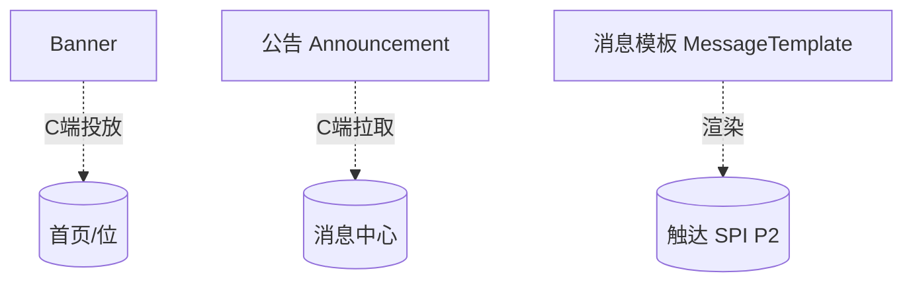
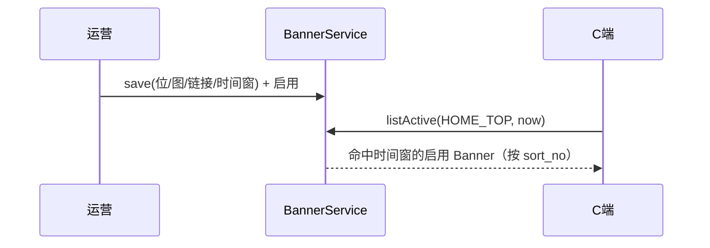
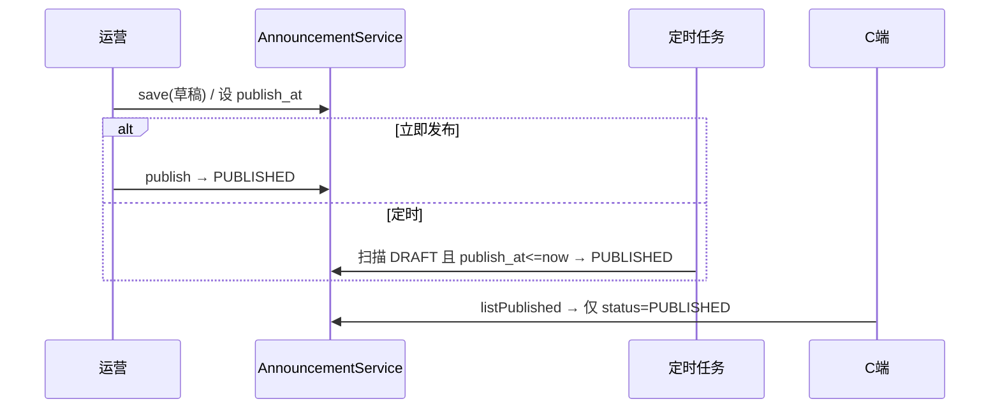

# 模块详细设计 · 数据运营（Operations）

> 版本：v1（字段级 + 接口级）
> 归属模块：`cognitive-enhancement-ai-platform`（admin 维护 + app 投放/触达）
> 关联：`docs/platform-architecture.md`、`docs/module-design-account.md`、`docs/module-design-knowledge.md`
> 产品基线：`CognitiveEnhancementJAiView/docs/后台管理设计.md`（数据运营）

---

## 0. 设计要点（锁定决策）

| # | 决策 | 结论 |
|---|---|---|
| O1 | Banner | 按位投放（position）+ 时间窗（start/end）+ 启停，C 端拉取**当前生效**列表 |
| O2 | Banner 位取值 | `position` 由**字典**（`qz_base_dict_type.code=banner_position`）维护，**V40/V2 SQL 种子初始化** |
| O3 | 公告发布 | 草稿/定时；**定时任务推进状态**（到点 DRAFT→PUBLISHED），非查询层判定 |
| O4 | 消息模板 | 模板化触达：渠道（SMS/EMAIL/IN_APP）+ 变量 schema；本期**只维护 + 预览渲染**，实发通道 P2（预留 SPI） |
| O5 | 公告定向 | ✅ 会员等级 / 用户 ID 逗号分隔；C 端按受众过滤 |
| O6 | Banner 生效 | 生效判定在查询层（`now BETWEEN start AND end` + status=ENABLED） |

---

## 1. 子域与对象总览



| 子域 | 表（`qz_ops_*`） | 聚合根 |
|---|---|---|
| Banner | `qz_ops_banner` | Banner |
| 公告 | `qz_ops_announcement` | Announcement |
| 消息模板 | `qz_ops_message_template` | MessageTemplate |
| 客服工单 | `qz_ops_support_ticket` | SupportTicket |

---

## 2. 数据模型（DO 字段级）

### 2.1 `qz_ops_banner` Banner

| 字段 | 类型 | 说明 |
|---|---|---|
| id / tenant_id | | |
| title | VARCHAR(128) | |
| image_url | VARCHAR(512) | 图片 |
| link_url | VARCHAR(512) | 跳转链接 |
| position | VARCHAR(32) | 投放位，取值来自字典 `banner_position`（内置项 SQL 初始化） |
| sort_no | INT | 同位排序 |
| status | VARCHAR(16) | ENABLED/DISABLED |
| start_time / end_time | DATETIME | 投放时间窗 |
| + 审计列 | | |

### 2.2 `qz_ops_announcement` 公告

| 字段 | 类型 | 说明 |
|---|---|---|
| id / tenant_id | | |
| title | VARCHAR(256) | |
| body | MEDIUMTEXT | 正文 |
| status | VARCHAR(16) | DRAFT/PUBLISHED |
| publish_at | DATETIME | 计划发布时间（定时任务到点推进 PUBLISHED） |
| target_level_codes | VARCHAR(512) | 定向会员等级编码，逗号分隔；空=不限 |
| target_user_ids | VARCHAR(2048) | 定向用户 ID，逗号分隔；空=不限 |
| + 审计列 | | |

### 2.3 `qz_ops_message_template` 消息模板

| 字段 | 类型 | 说明 |
|---|---|---|
| id / tenant_id | | |
| template_code | VARCHAR(64) U | 模板编码 |
| template_name | VARCHAR(128) | |
| channel | VARCHAR(16) | SMS/EMAIL/IN_APP |
| content | TEXT | 模板体（含 `${var}` 占位） |
| variable_schema | JSON | 变量定义（名/类型/必填） |
| status | VARCHAR(16) | ENABLED/DISABLED |
| + 审计列 | | |

### 2.4 `qz_ops_support_ticket` 客服工单

| 字段 | 类型 | 说明 |
|---|---|---|
| id / tenant_id | | |
| ticket_no | VARCHAR(32) U | 工单号 |
| title | VARCHAR(256) | 标题 |
| body | MEDIUMTEXT | 描述 |
| category | VARCHAR(64) | 分类（ACCOUNT/BILLING/GENERAL 等） |
| status | VARCHAR(16) | OPEN/IN_PROGRESS/RESOLVED/CLOSED |
| priority | VARCHAR(16) | LOW/NORMAL/HIGH |
| submitter_user_id | BIGINT | 提交人 |
| assignee_user_id | BIGINT | 处理人 |
| resolved_at | DATETIME | 解决时间 |
| + 审计列 | | |

---

## 3. 状态机

### Banner
```
DISABLED ⇄ ENABLED   （生效 = ENABLED 且 now ∈ [start_time, end_time]）
```

### 公告
```
DRAFT ──立即发布 / 定时任务到点(publish_at)推进──▶ PUBLISHED ──撤回──▶ DRAFT
```
（**定时推进**：调度任务扫描 `status=DRAFT 且 publish_at<=now` 的公告，置为 PUBLISHED；非查询层判定）

---

## 4. 领域对象（BO，platform.operations.domain）

```
Banner(id, title, imageUrl, linkUrl, position, sortNo, status, startTime, endTime)
Announcement(id, title, body, status, publishAt, targetLevelCodes, targetUserIds)
MessageTemplate(id, templateCode, templateName, channel, content, variableSchema, status)
SupportTicket(id, ticketNo, title, body, category, status, priority, submitterUserId, assigneeUserId, resolvedAt)
```

枚举：`BannerPosition`（字典驱动）、`OpsStatus{ENABLED,DISABLED}`、`AnnouncementStatus{DRAFT,PUBLISHED}`、`MessageChannel{SMS,EMAIL,IN_APP}`。

---

## 5. 数据操作层（Repository 接口）

```java
interface BannerRepository {
  PageResult<Banner> page(BannerPageQuery q);
  List<Banner> findActiveByPosition(String position, LocalDateTime now); // C端
  Optional<Banner> findById(Long id);
  Banner save(Banner b);
}
interface AnnouncementRepository {
  PageResult<Announcement> page(AnnouncementPageQuery q);
  List<Announcement> findPublished();                                    // C端，status=PUBLISHED
  List<Announcement> findDueScheduled(LocalDateTime now);                // 定时：DRAFT 且 publish_at<=now
  Optional<Announcement> findById(Long id);
  Announcement save(Announcement a);
}
interface MessageTemplateRepository {
  PageResult<MessageTemplate> page(MessageTemplatePageQuery q);
  Optional<MessageTemplate> findByCode(String code);
  Optional<MessageTemplate> findById(Long id);
  MessageTemplate save(MessageTemplate t);
}
```

---

## 6. 业务操作层（Service 方法 + 规则）

### 6.1 BannerService
- `page/detail/save/changeStatus`。
- C 端：`listActive(position)`（status=ENABLED 且时间窗命中，按 sort_no 排序）。
- 校验：`end_time > start_time`。

### 6.2 AnnouncementService
- `page/detail/save`（草稿）；`publish`（立即→PUBLISHED / 定时→设 `publish_at` 保持 DRAFT 待推进）；`withdraw`（→DRAFT）。
- C 端：`listPublished`（仅 `status=PUBLISHED`，再按 `target_level_codes` / `target_user_ids` 过滤）。
- **定时推进（admin-server + ShedLock）**：`AnnouncementScheduleJob` 周期扫描 `findDueScheduled(now)`（DRAFT 且 `publish_at<=now`）→ 置 PUBLISHED。

### 6.2.1 字典依赖（Banner 位）
- `banner_position` 字典类型 + 内置项（如 `HOME_TOP`/`SIDEBAR`/`POPUP`）由 **base-server / admin Flyway 种子**初始化；Banner 编辑下拉读 `GET /api/base/dict/banner_position/items`，保存时校验 `position` 属于该字典启用项。

### 6.3 MessageTemplateService
- `page/detail/save/changeStatus`（template_code 唯一）。
- `render(code, params)`：按 `variable_schema` 校验必填 → 占位替换 → 返回渲染文本。
- `MessageSender` SPI（**P2 骨架已完成**）：`DefaultNoopMessageSender` 占位；**P3** 接 SMS/EMAIL/IN_APP 实通道（见 `B-CMS-P3-01`）。

---

## 7. 接口设计（REST）

### 7.1 Admin（`/api/admin/ops`）

| 方法 | 路径 | 说明 | 权限点 |
|---|---|---|---|
| GET | `/banners` | Banner 分页 | `ops:banner:read` |
| POST | `/banners` | 新增/更新 Banner | `ops:banner:update` |
| POST | `/banners/{id}/status` | 启停 | `ops:banner:update` |
| GET | `/announcements` | 公告分页 | `ops:announcement:read` |
| POST | `/announcements` | 新增/更新公告 | `ops:announcement:update` |
| POST | `/announcements/{id}/publish` | 发布/定时 | `ops:announcement:publish` |
| POST | `/announcements/{id}/withdraw` | 撤回 | `ops:announcement:publish` |
| GET | `/message-templates` | 模板分页 | `ops:template:read` |
| POST | `/message-templates` | 新增/更新模板 | `ops:template:update` |
| POST | `/message-templates/{id}/preview` | 渲染预览 | `ops:template:read` |
| POST | `/message-templates/{id}/send` | 按模板发送 | `ops:template:update` |

### 7.2 C 端（`/api/app/ops`，App-Server）

| 方法 | 路径 | 说明 |
|---|---|---|
| GET | `/banners?position=HOME_TOP` | 当前生效 Banner |
| GET | `/announcements` | 已发布公告列表 |
| GET | `/announcements/{id}` | 公告详情 |
| GET | `/in-app-messages` | 我的站内信 |
| PUT | `/in-app-messages/{id}/read` | 标记已读 |
| GET/POST | `/support-tickets` | 工单列表 / 提单 |
| GET | `/support-tickets/{id}` | 工单详情 |

### 7.3 关键出参（VO 草案）

```jsonc
// GET /api/app/ops/banners?position=HOME_TOP
[ { "id": 1, "title": "新人专享", "imageUrl": "...", "linkUrl": "...", "sortNo": 0 } ]
```

---

## 8. 关键流程

### Banner 投放


### 公告发布（定时推进）


---

## 9. 权限点（规范）

| 规范码 | 前端 alias | 说明 |
|---|---|---|
| `ops:banner:read` | `admin:banner:read` | 查看 Banner |
| `ops:banner:update` | `admin:banner:update` | 维护/启停 Banner |
| `ops:announcement:read` | `admin:announcement:read` | 查看公告 |
| `ops:announcement:update` | `admin:announcement:update` | 编辑公告 |
| `ops:announcement:publish` | `admin:announcement:publish` | 发布/撤回 |
| `ops:template:read` | `admin:template:read` | 查看/预览模板 |
| `ops:template:update` | `admin:template:update` | 维护模板 |
| `ops:ticket:read` | `admin:ticket:read` | 查看客服工单 |
| `ops:ticket:update` | `admin:ticket:update` | 处理客服工单 |

---

## 10. 与现状差异（落地提示）

| 项 | 现状 | 目标 |
|---|---|---|
| 归属 | `platform` + admin/app | ✅ |
| C 端投放 | `/api/app/ops/banners`、`/announcements` | ✅ |
| Banner 位 | 字典 `banner_position` 种子（base-server V2 / admin V40） | ✅ |
| 公告发布 | `AnnouncementScheduleJob` 定时推进 | ✅ |
| 消息模板 | CRUD + `render` + Admin 预览 | ✅ |
| 消息发送 | `MessageSender` SPI；IN_APP 落库 + EMAIL/SMS 日志通道 + Admin `send` | ✅ |
| 客服工单 | V32 表 + Admin CRUD + 工作台 SUPPORT 待办 | ✅ |
| 公告定向 | `target_level_codes` / `target_user_ids` + C 端过滤 | ✅ |

---

## 11. 已确认决策（2026-06-22）

1. ✅ **Banner 位由字典维护**：字典类型 `banner_position`，内置项（HOME_TOP/SIDEBAR/POPUP 等）**SQL 种子初始化**；编辑下拉读字典、保存校验。
2. ✅ **公告定时推进状态**：`AnnouncementScheduleJob` 扫描 `DRAFT 且 publish_at<=now` → PUBLISHED；C 端只读 PUBLISHED。
3. ✅ **消息模板维护 + 预览 + 实发**：`MessageSender` SPI；IN_APP 落库，EMAIL/SMS 日志通道（生产可换第三方）。
4. ✅ **公告定向**：`target_level_codes` / `target_user_ids` 逗号分隔；两列皆空全员可见；C 端 OR 匹配等级或用户。

---

_下一模块建议：**系统设置**（字典/特性开关/安全配置/审计日志）或 **工作台**（首页看板聚合）。_
