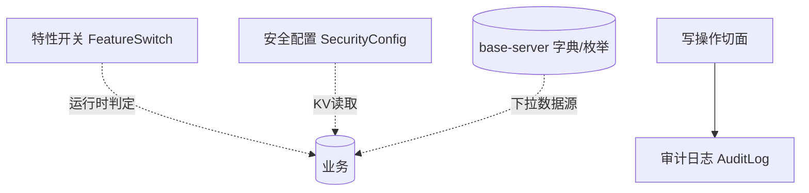
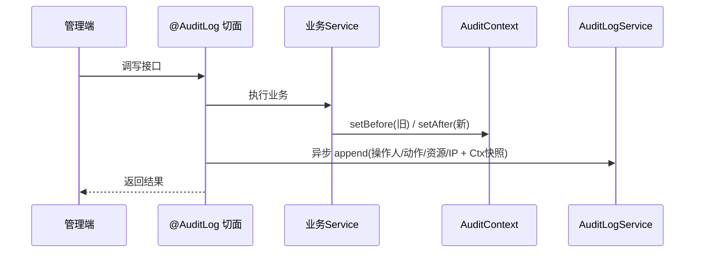

# 模块详细设计 · 系统设置（System）

> 版本：v1（字段级 + 接口级）
> 归属模块：`cognitive-enhancement-ai-platform`（特性开关/安全配置/审计；**字典/枚举已迁至 `cognitive-enhancement-ai-base-server`**）
> 关联：`docs/platform-architecture.md`、`docs/module-design-account.md`
> 产品基线：`CognitiveEnhancementJAiView/docs/后台管理设计.md`（系统设置）

---

## 0. 设计要点（锁定决策）

| # | 决策 | 结论 |
|---|---|---|
| S1 | 字典/枚举 | **已迁至 base-server**（`qz_base_dict_type` / `qz_base_dict_item`），API 前缀 `/api/base/**`；platform 不再维护 `qz_sys_dict_*` |
| S2 | 特性开关 | `feature_key` 布尔开关 + **灰度规则（比例/白名单）**，供业务运行时判定 |
| S3 | 安全配置 | KV 配置（登录策略/退款策略等），按 `config_key` 读取；**敏感值脱敏展示** |
| S4 | 审计日志 | 写操作切面记录（操作人/动作/资源/IP）；**前后快照由业务显式传入**，只写不改 |
| S5 | 缓存 | **以 Redis 为主**（统一缓存层）；少数超热点（如字典项）叠加 **Caffeine L1 本地缓存**；变更主动失效 |

---

## 1. 子域与对象总览



| 子域 | 表 | 聚合根 / 服务 |
|---|---|---|
| 字典/枚举 | `qz_base_dict_type` / `qz_base_dict_item`（base-server） | DictType / DictItem |
| 特性开关 | `qz_sys_feature_switch` | FeatureSwitch |
| 安全配置 | `qz_sys_security_config` | SecurityConfig |
| 审计日志 | `qz_sys_audit_log` | AuditLog |

---

## 2. 数据模型（DO 字段级）

### 2.1 字典/枚举（base-server，见 `cognitive-enhancement-ai-base-server`）

platform 侧 **`qz_sys_dict_type` / `qz_sys_dict_item` 已下线**（Flyway V40）。字典与枚举统一由 base-server 维护，表为 `qz_base_dict_type` / `qz_base_dict_item`，REST 见 `/api/base/dict/**`、`/api/base/enum/**`。

### 2.2 `qz_sys_feature_switch` 特性开关

| 字段 | 类型 | 说明 |
|---|---|---|
| id / tenant_id | | |
| feature_key | VARCHAR(64) U | 开关键 |
| feature_name | VARCHAR(128) | |
| segment | VARCHAR(8) | 2C/2B/2G/ALL |
| enabled | TINYINT | 总开关 |
| gray_rule_json | JSON | 灰度规则（按用户/比例/白名单） |
| + 审计列 | | |

### 2.3 `qz_sys_security_config` 安全配置

| 字段 | 类型 | 说明 |
|---|---|---|
| id / tenant_id | | |
| config_key | VARCHAR(64) U | 键（如 `login.maxFail`、`refund.revokeMembership`） |
| config_value | TEXT | 值（字符串/JSON） |
| description | VARCHAR(256) | |
| + 审计列 | | |

### 2.4 `qz_sys_audit_log` 审计日志（只追加）

| 字段 | 类型 | 说明 |
|---|---|---|
| id / tenant_id | | |
| operator_id / operator_name | | 操作人 |
| action | VARCHAR(64) | 动作（CREATE/UPDATE/DELETE/...） |
| resource_type / resource_id | | 资源 |
| before_json / after_json | JSON | 前后快照 |
| ip_address | VARCHAR(64) | |
| create_time | | 无 update/deleted/version |

---

## 3. 领域对象（BO，platform.system.domain）

```
FeatureSwitch(id, featureKey, featureName, segment, enabled, grayRule)
SecurityConfig(id, configKey, configValue, description)
AuditLog(operatorId, operatorName, action, resourceType, resourceId, before, after, ip)
```

字典/枚举 BO 见 base-server 模块 `cn.cyc.ai.cog.base.dict.*`。

枚举：`SysStatus{ENABLED,DISABLED}`、`AuditAction{CREATE,UPDATE,DELETE,STATUS,...}`。

---

## 4. 数据操作层（Repository 接口）

```java
interface FeatureSwitchRepository {
  PageResult<FeatureSwitch> page(FeatureSwitchPageQuery q);
  Optional<FeatureSwitch> findByKey(String key);      // 缓存
  FeatureSwitch save(FeatureSwitch f);
}
interface SecurityConfigRepository {
  List<SecurityConfig> listAll();
  Optional<SecurityConfig> findByKey(String key);     // 缓存
  SecurityConfig save(SecurityConfig c);
}
interface AuditLogRepository {
  void append(AuditLog log);
  PageResult<AuditLog> page(AuditLogPageQuery q);
}
```

---

## 5. 业务操作层（Service 方法 + 规则）

### 5.1 FeatureSwitchService
- `page/save`。
- `isEnabled(key, ctx)`：总开关 + `segment` + **灰度规则命中判定**：
  - **白名单**：`gray_rule.whitelist` 含当前 userId 直接命中；
  - **比例放量**：`gray_rule.percentage`，按 `hash(userId) % 100 < percentage` 稳定命中（同一用户结果稳定）；
  - 规则为空时仅看总开关 + segment。
- 变更刷新缓存。

### 5.2 SecurityConfigService
- `list/save`；强类型读取助手：`getString/getBoolean/getInt/getJson(key, default)`。
- 供退款策略、登录策略等业务读取（见计费/账号模块）。
- **敏感配置脱敏**：以约定前缀/标记识别敏感键（如 `secret.*`、`*.apiKey`），列表/详情返回掩码（如 `ab****yz`）；保存时若提交掩码值则保留原值不覆盖。
- 变更刷新缓存。

### 5.3 AuditLogService + 审计切面
- `@AuditLog(action, resourceType)` 注解 + AOP 环绕：
  - 取 `UserContext` 操作人、请求 IP；
  - **前后快照由业务显式传入**：业务在方法内通过 `AuditContext.setBefore(obj)/setAfter(obj)`（或返回带快照的结果）提供，切面只负责组装与落库，不自动反射抓取入参/返回；
  - 异步 `append`，失败不影响主流程。
- 查询：`page`（按操作人/资源/时间过滤），**禁更新/删除**。

---

## 6. 接口设计（REST）

### 6.1 Admin（`/api/admin/system`）

| 方法 | 路径 | 说明 | 权限点 |
|---|---|---|---|
| GET | `/feature-switches` | 开关分页 | `sys:feature:read` |
| POST | `/feature-switches` | 新增/更新开关 | `sys:feature:update` |
| GET | `/security-configs` | 安全配置列表 | `sys:security:read` |
| POST | `/security-configs` | 新增/更新配置 | `sys:security:update` |
| GET | `/audit-logs` | 审计日志分页 | `sys:audit:read` |

字典/枚举 CRUD 见 **base-server** `/api/base/dict/**`、`/api/base/enum/**`（网关 8801 转发）。

### 6.2 公共读取

| 方法 | 路径 | 说明 |
|---|---|---|
| GET | `/api/base/dict/{code}/items` | 启用字典项（admin/app 共用下拉） |
| GET | `/api/common/features` | 当前生效特性开关（前端按需） |

### 6.3 关键出参（VO 草案）

```jsonc
// GET /api/base/dict/banner_position/items
[ { "value": "HOME_TOP", "label": "首页顶部" } ]
```

---

## 7. 关键流程

### 审计日志切面（业务显式传快照）


### 字典读取缓存（base-server，可选）

字典项读多写少，base-server 可按需在 service 层叠加 Redis / 本地缓存；platform 侧不再维护 DictService。

---

## 8. 权限点（规范）

| 规范码 | 前端 alias | 说明 |
|---|---|---|
| `sys:dict:read` | `admin:dict:read` | 系统设置读（特性开关/安全配置/审计；**非字典专用**） |
| `sys:dict:update` | `admin:dict:update` | 系统设置写 |
| `sys:feature:read` | `admin:feature:read` | 查看开关 |
| `sys:feature:update` | `admin:feature:update` | 维护开关 |
| `sys:security:read` | `admin:security:read` | 查看安全配置 |
| `sys:security:update` | `admin:security:update` | 维护安全配置 |
| `sys:audit:read` | `admin:audit:read` | 查看审计日志 |

---

## 9. 与现状差异（落地提示）

| 项 | 现状 | 目标 |
|---|---|---|
| 归属 | platform 管开关/安全配置/审计；**字典/枚举在 base-server** | ✅ |
| 分层 | service→repository→mapper，返回 VO | ✅ |
| 表名 | 系统配置 `qz_sys_*`；字典 `qz_base_dict_*`（base-server） | ✅ |
| 缓存 | Caffeine L1 + 可选 Redis L2（`cog.platform.cache.redis-enabled`）+ Pub/Sub L1 广播失效 | ✅ |
| 审计 | `AdminAuditAspect` + 显式快照 | ✅ |

---

## 10. 已确认决策（2026-06-22）

1. ✅ **Redis 为主 + Caffeine L1**：统一缓存走 Redis；超热点（如字典项）叠加本地 Caffeine；变更失效 Redis 并广播失效本地缓存。
2. ✅ **审计快照业务显式传**：业务通过 `AuditContext.setBefore/setAfter` 提供，切面不自动反射抓取。
3. ✅ **灰度规则实现**：支持白名单 + 比例放量（`hash(userId)%100`），规则空时仅总开关 + segment。
4. ✅ **安全配置脱敏**：敏感键列表/详情返回掩码；提交掩码值时保留原值不覆盖。

---

_下一模块建议：**工作台**（首页看板，聚合各域统计，无独立表，纯读聚合）。_
