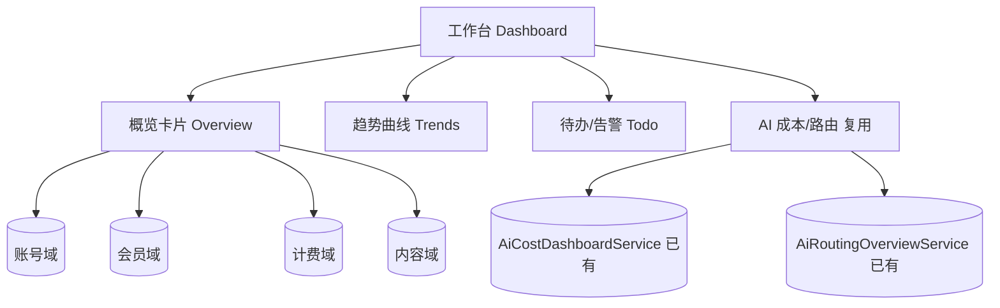
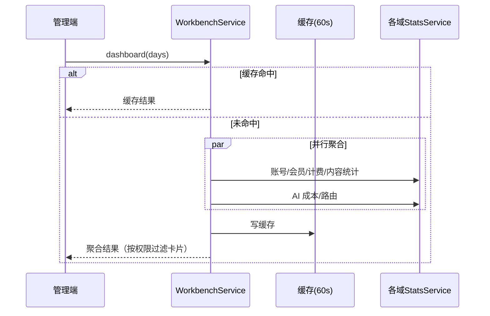

# 模块详细设计 · 工作台（Workbench / Dashboard）

> 版本：v1（接口级，纯读聚合）
> 归属模块：`cognitive-enhancement-ai-admin`（管理专属，编排聚合各域 Service）
> 关联：`docs/platform-architecture.md`、各业务模块设计文档
> 产品基线：`CognitiveEnhancementJAiView/docs/后台管理设计.md`（运营看板）

---

## 0. 设计要点（锁定决策）

| # | 决策 | 结论 |
|---|---|---|
| W1 | 定位 | **无独立表**，纯读聚合各业务域统计；不写库 |
| W2 | 数据来源 | 调各域 **统计 Service**（账号/会员/计费/内容/AI），不直接跨域查表 |
| W3 | 指标分类 | 概览卡片 + 趋势曲线 + 待办/告警 + AI 成本/路由（**内联**复用现有） |
| W4 | 性能 | 统计聚合走只读投影 + 结果缓存 **TTL 60s**（支持手动刷新绕过缓存） |
| W5 | 权限 | 进入工作台 `workbench:view`；各卡片按子域权限二次过滤 |
| W6 | 活跃用户 | 口径 = **按登录去重**（近 N 日有登录的用户数） |
| W7 | 趋势区间 | **默认 7 日**，支持**自定义起止日期** |
| W8 | AI 看板 | `/dashboard` **内联返回** AI 成本/路由（前端一次拿全） |

---

## 1. 看板信息架构



---

## 2. 指标清单

### 2.1 概览卡片（Overview，即时值）

| 指标 | 来源域 | 说明 |
|---|---|---|
| 用户总数 / 今日新增 | 账号 | `qz_iam_user` 计数 |
| 活跃用户（近 N 日） | 账号 | **按登录去重**：近 N 日 `last_login_time` 命中的用户数 |
| 付费会员数 / 各等级分布 | 会员 | `qz_mbr_account` 按 level 分组 |
| 今日/本月营收 | 计费 | `qz_bill_financial_record` INCOME 汇总 |
| 订单数 / 待处理 | 计费 | PENDING 订单计数 |
| 内容总量 / 待审核 | 内容 | PENDING 内容计数 |
| AI 今日 Token / 费用 | AI | 复用成本看板 |

### 2.2 趋势曲线（Trends，时间序列）

| 曲线 | 维度 | 区间 |
|---|---|---|
| 用户增长 | 按日新增/累计 | 默认 7 日，可自定义起止 |
| 营收趋势 | 按日 INCOME/REFUND | 默认 7 日，可自定义起止 |
| AI 成本趋势 | 按日 Token/费用 | 默认 7 日，可自定义起止 |
| 内容产出 | 按日发布数 | 近 30 日 |

### 2.3 待办 / 告警（Todo）

| 项 | 来源 | 触发 |
|---|---|---|
| 待审核内容 | 内容 | status=PENDING |
| 待支付订单 | 计费 | status=PENDING |
| 导入失败任务 | 内容 | ImportJob FAILED |
| 即将到期会员（运营提醒） | 会员 | expire_at < now+N 日 |
| AI 异常/熔断 | AI | 路由治理态异常 |

---

## 3. 领域对象（DTO，admin.workbench.dto）

```
DashboardOverview(userTotal, userTodayNew, activeUsers, paidMembers,
                  memberLevelDist[], revenueToday, revenueMonth,
                  orderTotal, orderPending, contentTotal, contentPending,
                  aiTokenToday, aiCostToday)
TrendSeries(metric, points[ { date, value } ])
DashboardTodo(pendingAudit, pendingOrder, failedImport, expiringMembers, aiAlerts)
DashboardResult(overview, trends[], todo, aiCost, aiRouting)
```

> 无 DO / Repository（不落库）。统计读取在各域 Service 暴露的 `*StatsService`。

---

## 4. 业务操作层（聚合 Service）

### 4.1 各域统计 Service（由对应模块提供，工作台只调用）

```java
interface AccountStatsService {
  long countUsers();
  long countUsersCreatedOn(LocalDate day);
  long countActiveUsers(int days);                       // 按 last_login_time 去重
  List<DailyPoint> userGrowth(LocalDate from, LocalDate to);
}
interface MembershipStatsService {
  long countPaidMembers();
  List<LevelCount> levelDistribution();
  long countExpiring(int days);
}
interface BillingStatsService {
  long revenueSum(LocalDateTime from, LocalDateTime to); // 分
  long countOrders(String status);
  List<DailyPoint> revenueTrend(LocalDate from, LocalDate to);
}
interface ContentStatsService {
  long countContents();
  long countByStatus(String status);
  long countFailedImports();
  List<DailyPoint> publishTrend(LocalDate from, LocalDate to);
}
// AI 复用现有：AiCostDashboardService / AiRoutingOverviewService
```

### 4.2 WorkbenchService（admin 聚合编排）
- `overview()`：并行调用各 `*StatsService` 组装 `DashboardOverview`（活跃用户按登录去重）。
- `trends(from, to)`：组装多条 `TrendSeries`，**默认区间近 7 日**，入参可自定义起止。
- `todo()`：组装待办/告警。
- `dashboard(from, to)`：一次性聚合 overview + trends + todo + **内联 AI 成本/路由**。
- 缓存：结果按 key（含起止区间）缓存 **TTL 60s**；`refresh=true` 时绕过缓存强制重算。
- 权限过滤：无某子域权限时，对应卡片置空/隐藏。

---

## 5. 接口设计（REST，Admin `/api/admin/workbench`）

| 方法 | 路径 | 说明 | 权限点 |
|---|---|---|---|
| GET | `/` | 角色化首页（2A）：待办 + 指标 + 快捷入口 | `workbench:view` |
| GET | `/dashboard?from=&to=&refresh=` | 一次性聚合看板（**内联 AI**，默认近 7 日） | `workbench:view` |
| GET | `/overview` | 概览卡片 | `workbench:view` |
| GET | `/trends?from=&to=` | 趋势曲线（默认近 7 日，可自定义起止） | `workbench:view` |
| GET | `/todo` | 待办/告警 | `workbench:view` |
| GET | `/ai/cost-dashboard` | AI 成本看板（已有，可独立调用） | `ai:cost:read` |
| GET | `/ai/routing-overview` | AI 路由总览（已有，可独立调用） | `ai:routing:read` |

> AI 两个接口已存在（`AiCostDashboardAdminController` / `AiRoutingAdminController`）；工作台 `/dashboard` **内联返回** AI 成本/路由，前端一次拿全（独立接口仍保留供深钻）。
> `from/to` 缺省时取近 7 日；`refresh=true` 绕过 60s 缓存。

### 关键出参（VO 草案）

```jsonc
// GET /api/admin/workbench/dashboard  (默认近 7 日)
{
  "range": { "from": "2026-06-16", "to": "2026-06-22" },
  "overview": {
    "userTotal": 1280, "userTodayNew": 35, "activeUsers": 410,  // activeUsers=近7日登录去重
    "paidMembers": 220, "memberLevelDist": [ {"level":"PRO","count":180} ],
    "revenueToday": 129900, "revenueMonth": 2360000,
    "orderTotal": 540, "orderPending": 6,
    "contentTotal": 320, "contentPending": 4,
    "aiTokenToday": 1850000, "aiCostToday": 4200
  },
  "trends": [ { "metric": "userGrowth", "points": [ {"date":"2026-06-16","value":28} ] } ],
  "todo": { "pendingAudit": 4, "pendingOrder": 6, "failedImport": 1, "expiringMembers": 12, "aiAlerts": 0 },
  "aiCost": { /* 内联 AiCostDashboardService 结果 */ },
  "aiRouting": { /* 内联 AiRoutingOverviewService 结果 */ }
}
```

---

## 6. 关键流程

### 看板聚合


---

## 7. 权限点（规范）

| 规范码 | 前端 alias | 说明 |
|---|---|---|
| `workbench:view` | `admin:workbench:view` | 进入工作台 |
| `ai:cost:read` | `admin:ai:cost:read` | AI 成本看板（已有） |
| `ai:routing:read` | `admin:ai:routing:read` | AI 路由总览（已有） |

> 各卡片二次过滤复用对应子域读权限（`iam:user:read`、`bill:order:read`、`kb:content:read` 等）。

---

## 8. 与现状差异（落地提示）

| 项 | 现状 | 目标 |
|---|---|---|
| 工作台 | `WorkbenchService` + `/api/admin/workbench/*` | ✅ |
| 角色化首页 2A | `GET /api/admin/workbench` + 多角色 IT | ✅ |
| 权限 | `workbench:view` 种子（V28）+ 子域权限二次过滤 | ✅ |
| 统计来源 | 各域 `*StatsService` | ✅ |
| 缓存 | 60s + `refresh=true` | ✅ |

---

## 9. 已确认决策（2026-06-22）

1. ✅ **活跃用户按登录去重**：近 N 日 `last_login_time` 命中的用户数。
2. ✅ **缓存 TTL 60s** + **手动刷新**（`refresh=true` 绕过缓存）。
3. ✅ **`/dashboard` 内联 AI 成本/路由**，前端一次拿全；独立 AI 接口保留供深钻。
4. ✅ **趋势默认 7 日 + 支持自定义起止**（`from/to` 入参，缺省取近 7 日）。

---

_至此七大业务模块（工作台/账号/会员/计费/知识内容/数据运营/系统设置）+ AI 治理（已有）设计完成。下一步可进入「按架构落地（抽 platform / 拆 app / 双启动 / DB 前缀）」的 rollout 阶段，待你批准后执行。_
