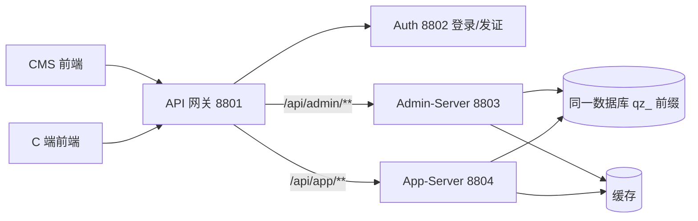
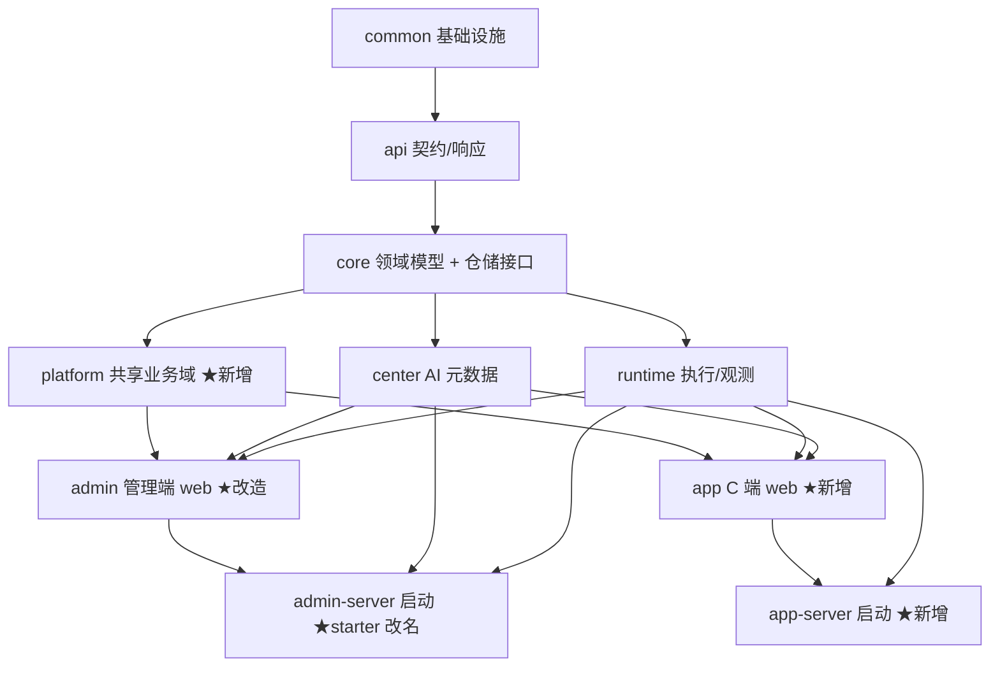

# 启知平台 · 整体架构设计（双端：Admin + C 端）

> 版本：v1.1（架构基线 + 落地状态）
> 定位：平台级架构基线。§6 分层迁移**已落地**；字段级/接口级设计见 `docs/module-design-*.md`。
> 关联：业务设计见 `docs/admin-backend-business-design.md`；前端产品基线见 `CognitiveEnhancementJAiView/docs/后台管理设计.md`。

---

## 0. 已确认决策（Decision Log）

| 编号 | 决策 | 结论 |
|---|---|---|
| D1 | 数据库表统一前缀 | **`qz_`**（启知品牌），同库按功能域分段 |
| D2 | 模块命名 | `…-platform`(共享业务) + `…-app`(C端web) + `…-admin-server`(管理启动) + `…-app-server`(C端启动) |
| D3 | 共享业务粒度 | 先合成**单个** `…-platform` 模块，后续按需再拆 |
| D4 | C 端启动 | **独立 `app-server`（8804）双进程**，与 admin-server 同库不同前缀 |
| D5 | 多租户 | 本期 **ToC 单租户**，`org_id`/`tenant_id` 预埋，不做机构层级 |

---

## 1. 背景与目标

平台由"一个后台 + 一个 C 端"组成，二者**业务域高度重叠**（账户、会员、额度、计费、内容），差异主要在 Web 入口与使用者：

| 维度 | Admin（管理后台） | C 端（学习者 App） |
|---|---|---|
| 使用者 | 管理员/运营/内容/客服 | 注册学习者 |
| 定位 | 供给侧：治理与配置 | 消费侧：学习与自助 |
| 能力 | 用户/会员/套餐/内容/AI 治理、看板、审计 | 我的会员、购买、我的额度、知识库学习、AI 评分/带学/问答 |
| 前端 | `packages/cms` | `packages/portal` / `cog` |

**架构主张**：**业务域共享、Web 端分离、启动应用分离、同库前缀分域**。

---

## 2. 进程拓扑



| 进程 | 端口 | 职责 |
|---|---|---|
| API 网关 | 8801 | 统一入口、OAuth2 验签、身份头透传（方案 B）、按前缀路由 |
| Auth | 8802 | 登录、发 JWT、OAuth2 JDBC |
| **Admin-Server** | 8803 | 管理后台业务（`/api/admin/**`、`/api/center/**`、`/api/admin/harness/**`） |
| **App-Server** | 8804 | C 端业务（`/api/app/**`、C 端 `/api/runtime/**` 执行） |

- 路由：网关按路径前缀分流；C 端流量大可单独横向扩容。
- 鉴权：两端复用网关验签 + `X-User-*` 透传；各自 `dev-auth-bypass=false`（prod）。

---

## 3. Maven 模块结构

### 3.1 目标依赖图



### 3.2 模块清单与变更

| 模块（artifactId） | 状态 | 职责 |
|---|---|---|
| `cognitive-enhancement-ai-common` | 不变 | 实体基类、分页、异常、安全常量、横切 |
| `cognitive-enhancement-ai-api` | 不变 | 对外契约、`ApiResponse`/`PageResult` |
| `cognitive-enhancement-ai-core` | 不变 | 领域模型 + 仓储接口（无 DB） |
| `cognitive-enhancement-ai-center` | 不变 | AI 元数据（模型/能力/Agent/Prompt/Tool/发布） |
| `cognitive-enhancement-ai-runtime` | 不变 | 执行、观测、Harness、用量 |
| `cognitive-enhancement-ai-platform` | **✅ 已落地** | 共享业务域：account/iam/org/membership/quota/billing/content/operations/system（domain+service+repository+entity+mapper） |
| `cognitive-enhancement-ai-admin` | **✅ 已改造** | 仅管理端 web + 管理专属服务（RBAC、审计、运营看板、AI 成本/路由）；业务域下沉 platform |
| `cognitive-enhancement-ai-app` | **✅ 已落地** | C 端 web：会员中心、购买下单、我的额度等（复用 platform service） |
| `cognitive-enhancement-ai-admin-server` | **✅ 已落地**（原 `-starter` 已移除） | 管理后台启动：装配 admin + platform + center + runtime（8803） |
| `cognitive-enhancement-ai-app-server` | **✅ 已落地** | C 端启动（8804）：装配 app + platform + runtime + center(只读) |
| `cognitive-enhancement-ai-sdk` | 不变 | 集成 SDK |

### 3.3 共享 vs 专属

| 关注点 | 归属 |
|---|---|
| account/membership/quota/billing/content 的 **service/repository/domain/entity/mapper** | `platform`（两端共享一份实现） |
| RBAC、审计切面、工作台、运营看板、AI 成本/路由看板 | `admin`（管理专属） |
| 会员中心、购买、我的额度、学习链路、AI 自助 | `app`（C 端专属 web，复用 platform service） |

> 范例：`MembershipService.changeLevel()` 仅一份实现于 platform；admin "手动授予"与 C 端"购买履约"都调用它。

---

## 4. 分层规范（两端统一）

`web → service → repository(接口) → mapper → entity`，三类对象严格分离：

| 对象 | 后缀 | 层 | 可见范围 |
|---|---|---|---|
| DO | `*Entity` | repository 内 | 仅 repository |
| BO | `domain` record | service 语言 | service / repository |
| VO/DTO | `dto`（`*Request`/`*Query`/`*VO`/`*Result`） | web 语言 | web |

**硬约束**：
- `service` 禁 import `*Mapper`/`*Entity`；只依赖 `repository` 接口。
- `web` 禁 import `*Entity`；返回 VO。
- 跨域只能 `service → 另一域 service`。
- 后续引入 ArchUnit 守门。

**横切统一**（common 基础设施）：多租户 `tenant_id` 拦截、乐观锁 `version`、逻辑删 `deleted`、审计 `@AdminAudit`、操作人/时间自动填充、统一响应包装。

平台共享业务域目标包结构（范本：`platform.billing`）：

```
cn.cyc.ai.cog.platform.billing
├── service/        OrderService（依赖 OrderRepository）
├── repository/     OrderRepository(接口) + DbOrderRepository(实现)
├── domain/         Order(BO)、OrderStatus
├── entity/         OrderEntity(DO，包内可见)
├── mapper/         OrderMapper
└── dto/            共享出入参（两端 web 各自再建专属 VO）
```

---

## 5. 数据库：同库 + 统一前缀分域

一个库，统一产品前缀 `qz_` + 功能域段，按域归类：

| 域段 | 前缀 | 现状表 → 目标（示例） |
|---|---|---|
| 身份权限 | `qz_iam_*` | `qz_iam_user→qz_iam_user`、`qz_iam_role→qz_iam_role`、`qz_iam_permission→qz_iam_permission`、`qz_iam_role_permission`、`qz_iam_user_role`、`qz_iam_tenant→qz_iam_tenant` |
| 账户组织 | `qz_acct_*` | `qz_acct_account→qz_acct_account`、`qz_acct_org→qz_acct_org`、`qz_acct_org_department`、`qz_acct_org_member` |
| 会员额度 | `qz_mbr_*` | `qz_mbr_level→qz_mbr_level`、`qz_mbr_account→qz_mbr_account`、`qz_mbr_membership_change_log`、`qz_mbr_quota_account→qz_mbr_quota_account`、`qz_mbr_quota_member_alloc`、`qz_mbr_token_record→qz_mbr_token_record` |
| 计费 | `qz_bill_*` | `qz_bill_order→qz_bill_order`、`qz_bill_subscription`、`qz_bill_subscription_package`、`qz_bill_quota_package`、`qz_bill_financial_record` |
| 知识内容 | `qz_kb_*` | `qz_kb_content→qz_kb_content`、`qz_kb_content_tag`、`qz_kb_content_tag_rel`、`qz_kb_knowledge_package(_item)`、`qz_kb_content_import_job` |
| 运营 | `qz_ops_*` | `qz_ops_banner→qz_ops_banner`、`qz_ops_announcement`、`qz_ops_message_template` |
| 系统 | `qz_sys_*` | `qz_sys_feature_switch`、`qz_sys_security_config`、`qz_sys_audit_log`（**字典已迁至 `qz_base_dict_*`，见 base-server**） |
| AI 元数据 | `qz_ai_*` | `center_*→qz_ai_*`（model/capability/agent/prompt/tool/release_pointer/tenant_binding） |
| 运行时 | `qz_rt_*` | runtime 各表（execution_record/usage/trace_span/session/feedback/knowledge/file…） |

**约定**：
- 框架表（`oauth2_*`、`shedlock`、`flyway_schema_history`）保持标准名，不加前缀。
- 实体侧 `@TableName` 同步调整；测试 schema（`admin-it-schema.sql`/`center-it-schema.sql`）同步。
- 研发阶段可清库：用新基线迁移 `V25__unify_table_prefix`（或重建脚本）一次性改名。
- 前缀候选：`qz_`（已选） / `cea_`（备选）。

---

## 6. 落地路线（行为不变，分步可回退）

> 每步"仅搬家/补层 + 改 import/表名"，行为不变，`./mvnw test` 全绿再进入下一步。

| 步骤 | 内容 | 状态 |
|---|---|---|
| 1 | **抽 platform**：共享业务域迁入 `cognitive-enhancement-ai-platform` | ✅ |
| 2 | **补分层**：`repository(接口+Db*)` + `domain(BO)`，platform service 去 Mapper | ✅ |
| 3 | **拆 app**：C 端控制器迁入 `cognitive-enhancement-ai-app` | ✅ |
| 4 | **双启动**：`admin-server`（8803）+ `app-server`（8804） | ✅ |
| 5 | **网关路由**：`/api/app/**` → app-server | ✅ |
| 6 | **DB 统一前缀**：`V25__unify_table_prefix` + `@TableName` + IT schema | ✅ |
| 7 | **守门**：ArchUnit（`PlatformLayerArchitectureTest` / `AdminWebLayerArchitectureTest`） | ✅ |

**验证命令（分层守门 + CMS 冒烟）：**

```bash
./mvnw -pl cognitive-enhancement-ai-platform test -Dtest=PlatformLayerArchitectureTest
./mvnw -pl cognitive-enhancement-ai-admin test -Dtest=AdminWebLayerArchitectureTest
./mvnw -pl cognitive-enhancement-ai-admin-server test \
  '-Dtest=Admin*IntegrationTest,CenterMetadataPersistenceIntegrationTest,AppOrderFlowControllerTest,AdminAuthMeWithTrustGatewayHeadersIntegrationTest' \
  -Dsurefire.failIfNoSpecifiedTests=false
```

**后续（P1+，见各 module-design）：** 工作台 Todo 聚合、计费超时关闭、RBAC repository 化、真实支付等。

---

## 7. 待下钻（后续逐模块）

- 各模块字段级/接口级设计（admin VO 与 app VO 的差异定义）。
- C 端学习链路与 runtime AI 能力（评分/带学/问答）的接口契约。
- 缓存策略（会员权益、字典、特性开关、模型路由）。
- app-server 的鉴权与限流（C 端高并发）。

---

_本文为平台架构基线 v1.1。§6 分层迁移已完成；产品细项按 module-design 与 backend-task-checklist 推进。_
